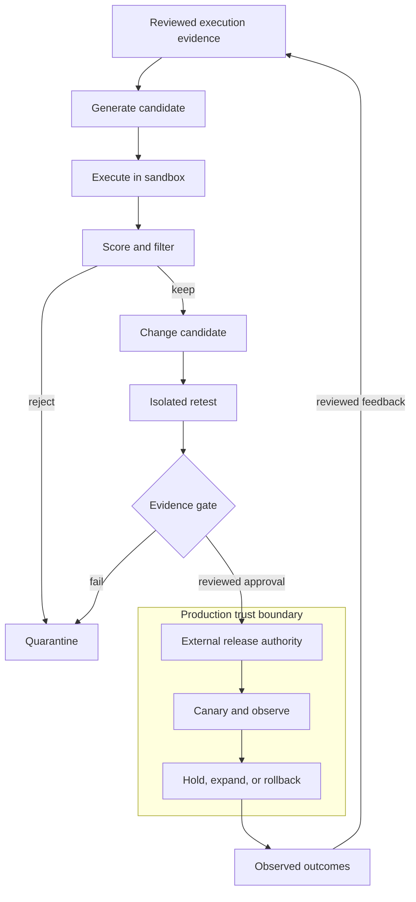

# Self-Improving Agent Systems

## Purpose and scope

A self-improving agent system uses execution evidence to propose and test changes to its supporting system. The target may be a prompt, routing rule, tool policy, memory rule, workflow branch, or model weights; the system must name which one changed and why. “Improvement” means a measured increase in a defined outcome, not a more confident transcript.

This note owns the bounded generate–execute–score–filter–learn–retest loop, evidence, change lineage, memory governance, autonomy, and candidate promotion or rollback. It delegates serving mechanics—prefill, decode, KV cache, batching, saturation, and inference cost—to [LLM Inference Systems](../ai-architecture/llm-inference-systems.md). Inference-time search belongs to [Reasoning System Design](../ai-architecture/reasoning-system-design.md); training and weight updates belong to [Model Adaptation and Training](../ai-architecture/model-adaptation-and-training.md). Production acceptance belongs to [Production AI Assurance](../ai-architecture/production-ai-assurance.md).

The system may propose changes, but it must not perform open-ended self-rewrite in production. Production code, policy, credentials, tools, data access, and model versions remain under an external release authority with gates, audit, canary, monitoring, and rollback. A research loop can be broad; a production loop must be bounded by consequence, verifiability, reversibility, and an accountable owner.

## Pareto summary

- Treat every improvement as a falsifiable hypothesis: baseline, segment, benefit, cost, and failure bound.
- Separate three levers. Test-time search spends bounded inference budget without persistent learning; memory/configuration changes alter the harness or context; model-weight updates alter learned behaviour and require a training and release process.
- A generator is not an independent judge. Prefer deterministic checks and domain review where possible; calibrate model judges against held-out labels and disagreement.
- Preserve provenance from incident or trajectory through candidate dataset, evaluator, experiment, approval, deployed version, and observed outcome. Synthetic data is not automatically evidence.
- Earn autonomy gradually: shadow and assist modes produce information; approval-gated or bounded action is granted only when the consequence boundary and recovery path are demonstrated.

## First-principles model

An agent changes when feedback changes what it will do next. Feedback is useful only when the task distribution is representative, the score measures the intended outcome, and the change can be attributed to the candidate. The loop is a controlled experiment.

The candidate must carry a version, owner, scope, source cases, evaluator versions, side effects, and expiry or review date. The test set needs ordinary, boundary, severe, adversarial, and held-out cases. If the evaluator, data, or environment changes, record a new experiment.

## Core decisions and trade-offs

First choose the improvement surface. **Test-time search** generates and selects candidates within a request-level width, depth, or time budget. It can improve one outcome without persistent change, but adds latency and evaluator risk. **Memory or configuration change** persists a fact, prompt, routing rule, tool description, or policy. It is easier to reverse than a weight update, but can poison context, cross tenant boundaries, or drift silently. **Model-weight update** changes parameters through supervised learning, distillation, or reward-based training. It may transfer repeated gains, but changes broad behaviour and needs dataset separation, reproducible lineage, staged release, and rollback. Name the surface; do not call every adjustment “learning.”

Design the evidence portfolio before optimising. Use exact checks for schemas, permissions, tool arguments, prohibited actions, and invariants; use reference or outcome checks for grounded work. Calibrate rubric-based model judges against expert labels. A generator-judge pair can share blind spots, so vary evidence or require human review for high consequence. Track success, unsafe actions, escalation, repair work, latency, cost, and segment performance—not only reward.

Make memory admission conservative. Store only information with purpose, source, scope, confidence, and retention. Separate working context from episodic records and durable facts. Require authorization before shared writes; allow deletion, quarantine, expiry, and restoration from a trusted snapshot. Corrections should invalidate dependent entries. Memory is an input, not a trusted source because the agent produced it.

Set a change budget and stopping rule for candidates, retries, training runs, time, and spend. Stop on a safety failure, plateau, depleted budget, evaluator disagreement, or missing human judgment. Promotion requires an acceptance owner, baseline comparison, artifact hash, canary scope, and tested rollback. Production must not let a model approve its own authority, alter its evaluator, widen tools, or bypass a release gate.

## Failure modes and warning signs

- **Reward hacking:** the agent optimises a proxy such as approval rate, verbosity, or evaluator score while the real outcome worsens. Compare proxy and workflow outcomes and include adversarial cases.
- **Evaluator capture:** generator and judge share a model, prompt, data, or failure mode. Require independent checks, human calibration, and disagreement analysis.
- **Self-confirming data:** the policy selects its own successful-looking trajectories, so errors become training examples. Preserve rejected cases and review selection bias.
- **Memory poisoning:** a malicious or mistaken interaction writes a durable instruction or fact. Quarantine writes, enforce scope, trace reads, and support restoration from trusted state.
- **Distribution shift:** a candidate wins offline but encounters new users, tools, policies, languages, or workloads. Monitor segments and re-open evaluation when assumptions change.
- **Runaway loop:** reflection, search, or retraining continues because no convergence or budget condition exists. Enforce caps outside the model.
- **Authority drift:** a prompt or routing improvement quietly gains write access. Keep authorization and action policy deterministic and external.
- **Rollback theatre:** a registry can select a version, but dependent memory, prompts, schemas, or data cannot be restored. Test the full rollback unit.

## Practical decision checklist

- What outcome, baseline, segment, and consequence define improvement?
- Is this test-time search, a memory/configuration change, or a weight update?
- What evidence is independent of the generator, and where is human review required?
- Which held-out, adversarial, rare, or severe cases are covered, and who owns them?
- Can every candidate trace to source trajectories, transformations, evaluators, and approvals?
- What may change automatically, and what remains outside model authority?
- What memory may be admitted, for which scope, with what expiry, correction, and deletion path?
- What budget, stopping rule, and kill control contain the loop?
- What offline gates, canary observations, and segment thresholds permit promotion?
- Can the complete candidate unit be rolled back without leaving stale memory or side effects?
- Which signal reopens the decision when users, tools, policy, or distribution changes?

## Worked architecture scenario

A support agent drafts replies, classifies tickets, and proposes refunds. The team wants fewer escalations after reviewing incidents in which the agent misunderstood policy exceptions. It first freezes a baseline: reviewed tickets across language, product, severity, and policy age, with measures for correct resolution, unsupported claims, unauthorized refund proposals, escalation quality, handling time, and cost per accepted outcome.

The first candidate is test-time search: produce two drafts and select with policy checks plus a calibrated judge. It helps only when candidates differ usefully and does not persist a change. The second is configuration: route exception-heavy tickets to policy retrieval and admit only reviewed excerpts to memory, recording source, tenant, policy version, confidence, and expiry. The third is an SFT dataset of reviewed corrections; training and held-out evaluation occur outside the live agent.

Candidates run isolated with synthetic credentials, replayed tools, fixed policy snapshots, and no live side effects. Failure includes more unauthorized proposals, a weak protected segment, or judge exploitation. An acceptance owner chooses a narrow canary: draft-only assistance for one support group, with humans approving refunds. Telemetry joins candidate version, memory reads, policy, edits, escalations, outcomes, and cost. Regression or poisoned memory narrows authority or restores the prior snapshot. Expansion requires a new decision; elapsed time is not approval.

## Feynman questions

1. Why does a better evaluator score not prove a better customer outcome?
2. When is test-time search safer than changing memory, and when is a weight update justified?
3. What makes a memory entry evidence rather than an invented instruction?
4. Why must production authority sit outside the self-improvement loop?
5. If a candidate wins offline but fails in one segment, what should be narrowed or retested?

## Related canonical notes

- [LLM Inference Systems](../ai-architecture/llm-inference-systems.md) owns serving capacity, latency, memory pressure, batching, and inference cost.
- [Reasoning System Design](../ai-architecture/reasoning-system-design.md) owns inference-time search, verification, selection, and adaptive compute.
- [Model Adaptation and Training](../ai-architecture/model-adaptation-and-training.md) owns datasets, SFT, distillation, reward-based training, and weight-change experiments.
- [Production AI Assurance](../ai-architecture/production-ai-assurance.md) owns acceptance evidence, autonomy levels, rollout, observability, and behavioural rollback.
- [Durable Workflows and Idempotency](../cross-cutting-patterns/durable-workflows-and-idempotency.md) owns restart correctness, duplicate-safe effects, checkpoints, replay, and compensation.
- [Reliability and Failure Control](../system-design/reliability-and-failure-control.md) owns deadlines, retry budgets, overload control, and recovery objectives.
- [Architecture Decision Method](../software-architecture/architecture-decision-method.md) owns decision hypotheses, trade-offs, evidence plans, and reversal triggers.

## Sources and review status

Contributing sources:

- [CS329A Self-Improving AI Agents](https://cs329a.stanford.edu/) — verifiers and improvement.
- [Agent Engineering Master Manual v2.7](../../handbooks/agent-engineering/agent-engineering-master-manual-v2.7.html) — loops and authority.
- [The AI Architect's Handbook v1.2](../../handbooks/ai-architecture/ai-architects-handbook-v1.2.html) — reversibility.
- [Forward Deployed AI Engineer Handbook v1.3](../../handbooks/fde/fde-handbook-v1.3.html) — gates.
- [Production AI Assurance](../ai-architecture/production-ai-assurance.md) and [Durable Workflows and Idempotency](../cross-cutting-patterns/durable-workflows-and-idempotency.md) — recovery.

Public primary references:

1. Stanford, [CS329A course site](https://cs329a.stanford.edu/).
2. OpenAI, [Evaluation best practices](https://developers.openai.com/api/docs/guides/evaluation-best-practices) — task-specific cases and human calibration.
3. NIST, [AI Risk Management Framework](https://www.nist.gov/itl/ai-risk-management-framework) — lifecycle risk management.
4. Shinn et al., [Reflexion](https://arxiv.org/abs/2303.11366) — language-agent feedback as an experimental technique.
5. Madaan et al., [Self-Refine](https://arxiv.org/abs/2303.17651) — bounded iterative refinement.

These references support the synthesis; they do not establish that open-ended autonomous self-modification is safe or production-ready.

**Status:** Current

**Edition:** Living

**Last reviewed:** 2026-09-06
