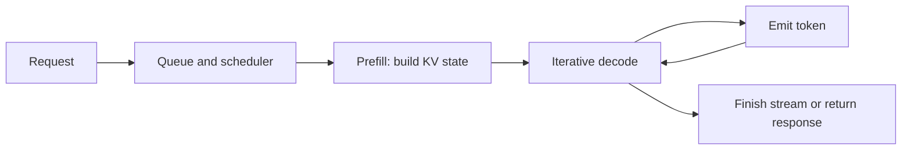

# LLM Inference Systems

## Purpose and scope

LLM inference is the path from an accepted request to generated tokens. Its architecture is a serving-capacity problem involving computation, memory, scheduling, latency, fairness, and cost. This note owns prefill and decode, weights and KV cache, batching, queueing, capacity tests, and bottleneck-driven optimisation.

It deliberately does not teach kernel implementation, CUDA programming, model training, or behavioural evaluation. [Production AI Assurance](./production-ai-assurance.md) owns quality, authority, rollout, and AI-specific acceptance evidence. [Reliability and Failure Control](../system-design/reliability-and-failure-control.md) owns deadlines, overload control, retry budgets, and recovery objectives. [Architecture Decision Method](../software-architecture/architecture-decision-method.md) owns the recorded trade-off and reversal trigger.

## Pareto summary

1. **Generation has two phases.** Prefill processes the prompt; decode repeatedly produces next tokens. Their arithmetic intensity, memory traffic, and latency symptoms differ.
2. **Memory is a first-class capacity limit.** Weights, KV cache, temporary activations, and runtime overhead compete for accelerator memory. Long contexts and many live sequences can exhaust memory before arithmetic throughput is full.
3. **Batching is scheduling, not a magic speedup.** Static, dynamic, and continuous batching trade utilisation against waiting, fairness, padding, and latency. The policy must match the workload and objective.
4. **Saturation is a queueing transition.** Increasing concurrency can improve throughput until a resource reaches its safe envelope; after that, queue time and tail latency grow faster than useful work.
5. **Optimise the measured bottleneck and outcome.** Tokens per second is useful, but cost per timely result and the slowest important segment decide whether a change helps.

## First-principles model

For prompt tokens (P) and generated tokens (G), prefill performs a parallel pass over (P). Decode then performs roughly (G) sequential steps, attending to prior state and appending to the KV cache. Multiple requests can share a batch, but streaming does not remove the sequential dependency.

The resident footprint is model weights plus KV cache, temporary buffers, and runtime overhead. Quantisation can reduce bytes, and paged KV management can reduce fragmentation, but both require workload tests for quality, compatibility, and scheduling. A useful capacity model is:

`arrival rate × work per request ≤ safe service capacity`

Work includes prompt tokens, generated tokens, protocol overhead, and retries. Prefill often stresses matrix computation and prompt bandwidth; decode can become memory-bandwidth- or cache-capacity-bound as active sequences move state. Infer the boundary from counters and controlled experiments rather than naming a phase universally compute-bound or memory-bound.

## Core decisions and trade-offs

- **Placement and model shape:** Smaller or quantised models may improve capacity, but compare task quality and tool behaviour on representative cases. Parallel placement can increase usable capacity while communication consumes time and memory.
- **Batch policy:** Static batching waits for a fixed group and may pad. Dynamic batching forms groups over a short window. Continuous batching admits and retires sequences as decode progresses, improving utilisation for uneven lengths while complicating fairness and cache accounting. Set maximum tokens, sequence count, age, and priority explicitly.
- **Memory policy:** Budget weights, KV cache, workspace, fragmentation, and safety margin separately. Limit context and output lengths by consequence and cost, not only model maximums. Eviction, prefix reuse, or paged allocation needs an ownership and invalidation rule; stale or cross-tenant state is a correctness failure.
- **Streaming contract:** Define time to first token (TTFT), inter-token latency (ITL), completion latency, cancellation, backpressure, and partial-output semantics. TTFT reflects queue plus prefill; ITL reflects decode scheduling and contention. A fast first token can hide a stalled stream.
- **Admission and fairness:** Reserve capacity for interactive work, bound queue age, and decide which requests shed first. Priority must be observable and abuse-resistant. Unlimited queues convert overload into stale results and poor tails.
- **Optimisation order:** Establish a baseline, identify the dominant queue, phase, memory, communication, or downstream bottleneck, then change one lever. Test batching, prefix caching, quantisation, kernel fusion, speculative decoding, or parallel placement with quality and cancellation guardrails.
- **Economics:** Attribute accelerator time, host resources, networking, idle capacity, retries, and support. Report cost per accepted successful outcome at target concurrency, not only per-token price or peak throughput.

## Failure modes and warning signs

- **One blended latency number:** Mean end-to-end latency hides queue delay, TTFT, ITL, and completion tails. A dashboard improves while users wait longer for the first useful token.
- **Throughput benchmark theatre:** A closed, fixed-length benchmark omits cancellations, uneven lengths, contention, and admission policy. Production traffic reaches a different bottleneck.
- **KV-cache pressure:** Memory usage rises with active sequences and context length; fragmentation or an overly small safety margin causes evictions, allocation failures, or a sudden throughput cliff.
- **Unbounded concurrency:** More clients briefly increase throughput, then saturate memory, workers, or device bandwidth. Queue time and p99 latency grow while accepted outcomes become stale.
- **Unfair batching:** Long generations monopolise decode slots, or high-priority traffic starves ordinary work. Per-tenant and per-class latency reveals the harm hidden by an aggregate.
- **Misplaced optimisation:** Quantisation can harm quality; speculative decoding can add verifier work without enough accepted tokens; prefix reuse can leak across isolation boundaries; a kernel or placement change can move the bottleneck elsewhere.
- **Broken streaming:** Tokens are buffered until completion, cancellation does not release state, client backpressure is ignored, or a terminal error is indistinguishable from a valid partial answer.
- **Signal without correlation:** GPU utilisation, engine metrics, application traces, and queue data use different request IDs or clocks. Teams cannot distinguish admission delay from prefill, decode, or downstream latency.

## Practical decision checklist

- What are target token distributions, concurrency, bursts, cancellation rate, and priority classes?
- Do traces separate queue time, prefill, first-token delay, each decode interval, post-processing, and total completion?
- Which resource saturates first: device compute, memory capacity or bandwidth, host CPU, network, scheduler, or a dependency?
- What are the KV-cache budget, allocation policy, eviction behaviour, tenant boundary, and failure response?
- Which batching policy controls admission, maximum age, sequence retirement, fairness, and backpressure?
- Are TTFT, ITL, completion latency, throughput, queue age, error rate, cancellation, and tail percentiles measured together?
- What happens when demand exceeds capacity: reject, defer, degrade, route, or shed—and how is that communicated?
- Is every optimisation compared with a fixed workload, quality guardrail, cost denominator, and rollback path?
- Can application, inference-engine, and accelerator signals be joined to one request and one accepted outcome?
- Has the endpoint been tested at saturation, with long contexts, mixed lengths, failures, cancellation, and recovery?

## Worked architecture scenario

Consider a document-assistance endpoint. At low concurrency it returns quickly, but with higher concurrency throughput improves while first tokens and tails get worse. The team measures queue time, TTFT, ITL, completion latency, token lengths, active sequences, KV bytes, device memory, scheduler age, cancellations, and retrieval time. Traces carry request, tenant, priority, model, and engine version IDs.

The evidence separates hypotheses. Queue growth before device saturation points to admission or workers. TTFT rising with prompt length while decode is stable points to prefill. ITL and KV occupancy rising with active sequences while arithmetic utilisation is moderate points to decode memory traffic or cache pressure. Independent retrieval slowdown is a downstream bottleneck.

The team chooses dynamic admission with a short batching window, separate interactive and batch budgets, and bounded queue age. It enforces token limits, reserves KV headroom, emits tokens during decode, and releases cancelled sequences. Batch jobs are deferred or shed before interactive requests; no class receives an unbounded queue.

Only after this baseline does the team test paged KV allocation and a smaller quantised model. Each candidate is evaluated against quality, refusal behaviour, TTFT, ITL, tails, memory, and cost per accepted answer. A change is rejected if throughput improves but unsupported answers rise or a high-consequence segment misses its deadline. The final test uses mixed lengths and bursts through saturation, then verifies graceful rejection and recovery.

## Feynman questions

1. Why can prefill and decode need different optimisation strategies even for the same request?
2. Explain why a larger batch can increase throughput while making one user's first token later.
3. Which memory objects grow with active sequences, and what evidence would distinguish cache pressure from compute saturation?
4. Why is TTFT alone insufficient for a streaming contract? Give a case where ITL or cancellation matters more.
5. What would convince you that a quantised model is a better architecture, rather than merely a cheaper benchmark result?

## Related canonical notes

- [Production AI Assurance](./production-ai-assurance.md) owns representative evaluation, consequence-aware thresholds, autonomy, observability, economics, rollout, and behavioural rollback.
- [Reliability and Failure Control](../system-design/reliability-and-failure-control.md) owns deadlines, retry budgets, admission control, backpressure, overload shedding, degradation, and recovery objectives.
- [Durable Workflows and Idempotency](../cross-cutting-patterns/durable-workflows-and-idempotency.md) owns duplicate-safe operations, checkpoints, replay, compensation, and reconciliation when an inference step participates in a longer workflow.
- [Architecture Decision Method](../software-architecture/architecture-decision-method.md) owns quality scenarios, alternatives, evidence, trade-offs, ADRs, and reversal triggers.
- [Model Adaptation and Training](./model-adaptation-and-training.md) owns SFT, distillation, reward-based training, and methods that change model weights.

## Sources and review status

Contributing sources:

- [AI Engineering Handbook v3.0](../../handbooks/ai-engineering/ai-engineering-handbook-v3.0.html)
- [Agent Engineering Master Manual v2.7](../../handbooks/agent-engineering/agent-engineering-master-manual-v2.7.html)
- [The AI Architect's Handbook v1.2](../../handbooks/ai-architecture/ai-architects-handbook-v1.2.html)
- CS336 Handwritten Visual Notebook, inference and GPU-systems sections (private/source-synthesis asset consulted; public course counterpart is [Stanford CS336](https://cs336.stanford.edu/spring2025/); concepts synthesised here)
- [Production AI Assurance](./production-ai-assurance.md), for evaluation, cost, and rollout boundaries

Public primary references (accessed 2026-09-06):

1. [Kwon et al., Efficient Memory Management for Large Language Model Serving with PagedAttention](https://arxiv.org/abs/2309.06180).
2. [Dao et al., FlashAttention](https://arxiv.org/abs/2205.14135).
3. [Yu et al., Orca: A Distributed Serving System for Transformer-Based Generative Models](https://www.usenix.org/conference/osdi22/presentation/yu).
4. [NVIDIA, CUDA Programming Guide](https://docs.nvidia.com/cuda/cuda-programming-guide/index.html).

**Status:** Current

**Edition:** Living

**Last reviewed:** 2026-09-06
