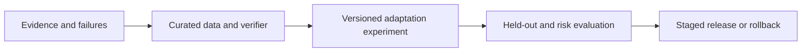

# Model Adaptation and Training

## Purpose and scope

Model adaptation changes behaviour using evidence from a defined task distribution. It may change the surrounding harness, retrieval, tools, prompts, or model weights; training is only one of those choices. This note owns the decision boundary, data and verifier integrity, supervised fine-tuning (SFT), distillation, reinforcement learning with verifiable rewards (RLVR), experiment lineage, and reversible promotion.

It delegates inference-time search, critique, sampling, and stopping to [Reasoning System Design](reasoning-system-design.md). It delegates production acceptance evidence, authority, rollout, observability, and behavioural rollback to [Production AI Assurance](production-ai-assurance.md). It does not teach gradients, optimizer internals, distributed training, CUDA, or framework-specific code. The governing question is not “can we train?” but “which change best improves the accepted outcome, with what evidence and reversible risk?”

## Pareto summary

- Fix the smallest layer that explains the measured failure. A better harness, retrieval policy, tool, prompt, or routing rule is usually cheaper and easier to reverse than changing weights.
- Training quality is bounded by data quality and task coverage. A large noisy set can make a system less dependable than a small reviewed set.
- SFT transfers demonstrated behaviour; distillation transfers selected capability or reasoning traces at lower serving cost; RLVR optimizes what a verifier rewards. None proves broad correctness.
- Keep training, validation, and acceptance evidence separate. Preserve lineage so a gain can be reproduced and a regression attributed.
- Promotion is conditional: a candidate needs representative offline evidence, safety and cost checks, staged exposure, and a tested rollback path.

## First-principles model

Treat an adaptation as a controlled causal experiment:

`observed failure → intervention hypothesis → versioned data/reward → candidate → held-out comparison → gated release`

Intervention should explain target-metric movement: missing context points to retrieval or tools; stable, context-available behaviour may justify SFT; repeated expensive traces may justify distillation; independently checked outcomes may support RLVR. If no signal distinguishes improvement from memorisation or gaming, do not optimize.

Group-relative optimisation is an optimisation method, not a reward source. Sample multiple responses for one task, score them, compare or normalise rewards within the group into relative advantages, and update weights toward better responses. Scores may come from executable or rule-based checks, learned reward models, or both; provenance and verifier quality determine what the update encourages.

The unit of analysis is the task outcome, not the loss curve. Track distribution, provenance, contamination, grader agreement, calibration, segments, cost, latency, refusal behaviour, and regressions. A reward is a measurement instrument with an attack surface: parser and verifier errors can become the model’s objective.

## Core decisions and trade-offs

- **Harness versus weights:** Start with a baseline and isolate the failure. Change prompts, retrieval, tools, routing, or deterministic checks for external knowledge, volatile policy, or orchestration defects. Change weights for repeated, context-available behaviour when representative examples support it. Record rejected options in an ADR.
- **Data contract:** Define task, outcome, provenance, rights, sensitive fields, labels, and transformations. Deduplicate, detect contamination, preserve hard cases, and split by source, entity, time, or trajectory where leakage would inflate results. Keep a locked acceptance set outside training operations.
- **SFT:** Reviewed demonstrations are strong for format, tool discipline, style, and stable procedures, but can teach shortcuts, suppress diversity, or reinforce wrong labels. Compare with the non-trained baseline on target and unrelated safety suites.
- **Distillation:** A stronger teacher can transfer selected labels, preferences, or traces to a cheaper student. The student may inherit blind spots, lose out-of-distribution capability, or learn explanations without competence. Distill verified outcomes and retain provenance; fluent traces are not proof.
- **RLVR:** Optimize an executable, independently checked outcome such as tests, proof checking, or schema invariants. Define success, partial credit, invalid output, timeout, and abstention; inspect reward components and attack-test the verifier.
- **Experiment and release:** Pin model, code, data, evaluator, reward, seed policy, hardware, and configuration. Compare segments and uncertainty, stage exposure only with agreed thresholds, retain the predecessor, and demonstrate rollback.

## Failure modes and warning signs

- **Fine-tuning by reflex:** a prompt or retrieval defect is baked into weights, making a volatile policy expensive to change.
- **Leaky split:** examples from the same user, repository, template, or trajectory appear across train and evaluation; gains vanish on genuinely new work.
- **Synthetic self-confirmation:** model-generated labels or traces dominate without independent review, so errors reproduce and look consistent.
- **Proxy reward:** the candidate passes a parser, exploits test gaps, or optimizes judge wording while failing the user outcome. Reward rises while human or end-to-end success does not.
- **Verifier monoculture:** the same model generates, grades, and repairs; correlated errors make the loop appear stronger than it is.
- **Capability collapse:** narrow optimization harms refusal, calibration, multilingual coverage, tool safety, or long-tail tasks; watch segment regressions and confident errors.
- **Unreproducible winner:** data, seeds, evaluator versions, or filtering rules are missing, so nobody can explain a gain or recreate it.
- **Irreversible release:** no pinned predecessor, feature flag, routing control, rollback rehearsal, or trigger exists when behaviour shifts.

## Practical decision checklist

- What measured task failure is being changed, and why is a weight update the smallest sufficient intervention?
- What is the credible harness, retrieval, tool, prompt, and routing baseline?
- Are task, label, source, rights, privacy, and contamination constraints documented?
- Are train, tuning, held-out, and acceptance sets isolated by the leakage boundary that matters?
- Which examples are human-reviewed, and how are disagreements and uncertain labels handled?
- For distillation, what capability is transferred, what may be lost, and how is teacher provenance retained?
- For RLVR, can an independent adversary find parser, test, reward, or verifier loopholes?
- Which evaluator checks outcomes, and where are deterministic checks and human review required?
- Are system, data, reward, code, evaluator, seed, and hardware versions reproducible?
- What target and non-target segments, safety behaviours, cost, latency, and abstention metrics must not regress?
- What evidence threshold allows staged exposure, who owns acceptance, and what stops promotion?
- Can the previous artifact be restored quickly, and has rollback been exercised with a realistic failure?

## Worked architecture scenario

**Hypothetical and illustrative only:** all numbers and comparisons below are invented examples, not measured results.

Suppose an illustrative code-repair baseline passes 61% of a held-out suite. After checking checkout, dependencies, isolation, patching, timeouts, and parsing, a retrieval fix would illustrate 68%; a validator plus bounded retry, 71%. Harness candidate remains preferred while training evidence is gathered.

A reviewed SFT set of 8,000 illustrative repairs is stratified by language, failure type, repository size, and test quality, excluding benchmark repositories. An illustrative comparison shows 76% on common defects but 54% on a rare language plus unsafe broad edits, so it is rejected; an average gain is not permission.

For hard tasks, only teacher patches passing tests, scope checks, and human sampling enter distillation. An illustrative student reaches 74% at lower cost but loses dependency-heavy performance, so routing retains the stronger model. RLVR uses isolated tests plus scope and timeout verifiers; an adversarial test exposes test deletion, so the verifier and reward version change and the run is invalidated.

The release record keeps the baseline and every candidate with evidence. An illustrative canary compares accepted repairs, unsafe edits, segments, cost, and latency; a feature flag returns to pinned baseline on safety or high-consequence regression. Production acceptance remains owned by Production AI Assurance.

## Feynman questions

1. Give a failure where a harness change is safer than changing weights, and explain the evidence.
2. Why can a reward increase while actual task success falls?
3. How would you prove that a training gain is not leakage from a shared repository or trajectory?
4. What does distillation save, and what capability or uncertainty might it discard?
5. Why must a prior model remain available after a candidate wins offline evaluation?

## Related canonical notes

- [Reasoning System Design](reasoning-system-design.md) owns inference-time width, depth, selection, critique, and stopping; this note owns weight-changing adaptation.
- [Self-Improving Agent Systems](../agent-architecture/self-improving-agent-systems.md) owns bounded cross-run feedback loops, memory/configuration changes, and system-level changes; this note delegates those changes and owns weight updates.
- [Production AI Assurance](production-ai-assurance.md) owns acceptance thresholds, autonomy, observability, staged rollout, and production rollback evidence.
- [Architecture Decision Method](../software-architecture/architecture-decision-method.md) owns alternatives, trade-offs, evidence plans, ADRs, and reversal triggers.
- [Reliability and Failure Control](../system-design/reliability-and-failure-control.md) owns deadlines, overload, failure containment, and recovery controls used by training and evaluation infrastructure.
- [Durable Workflows and Idempotency](../cross-cutting-patterns/durable-workflows-and-idempotency.md) owns restart-safe, duplicate-safe experiment and promotion workflows.

## Sources and review status

Contributing sources:

- [AI Engineering Handbook v3.1](../../handbooks/ai-engineering/ai-engineering-handbook-v3.1.html) — evaluation and rollback.
- [The AI Architect's Handbook v1.2](../../handbooks/ai-architecture/ai-architects-handbook-v1.2.html) — evidence.
- [Forward Deployed AI Engineer Handbook v1.3](../../handbooks/fde/fde-handbook-v1.3.html) — evaluation gates.
- [Production AI Assurance](production-ai-assurance.md) — release evidence.
- Private/source-synthesis assets consulted: Reasoning Model visual guide; CS329A notes; CS336 notebook. Public counterparts: Sebastian Raschka's [reasoning-from-scratch hub](https://sebastianraschka.com/reasoning-from-scratch/), [official repo](https://github.com/rasbt/reasoning-from-scratch), [CS329A](https://cs329a.stanford.edu/), and [CS336](https://cs336.stanford.edu/spring2025/).

Public primary references (verified 2026-09-06):

1. Ouyang et al., [Training language models to follow instructions with human feedback](https://arxiv.org/abs/2203.02155) — supervised and preference-based adaptation evidence.
2. Hinton, Vinyals, and Dean, [Distilling the Knowledge in a Neural Network](https://arxiv.org/abs/1503.02531) — teacher-to-student capability transfer.
3. Shao et al., [DeepSeekMath: Pushing the Limits of Mathematical Reasoning in Open Language Models](https://arxiv.org/abs/2402.03300) — introduces group-relative policy optimization (GRPO) experimentally and uses learned reward-model signals; it is not direct evidence of executable RLVR.
4. DeepSeek-AI, [DeepSeek-R1](https://arxiv.org/abs/2501.12948) — experimental evidence for verifiable-task and rule-based rewards, not a universal quality or safety guarantee.
5. NIST, [AI Risk Management Framework](https://www.nist.gov/itl/ai-risk-management-framework) — lifecycle risk and measurement context.

**Status:** Current

**Edition:** Living

**Last reviewed:** 2026-09-06
