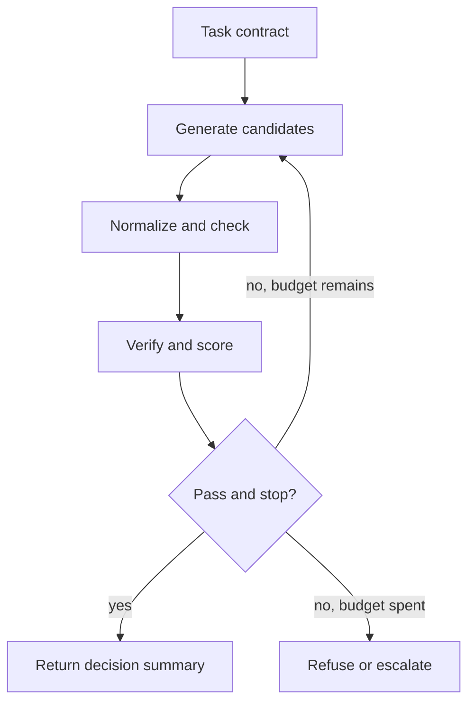

# Reasoning System Design

## Purpose and scope

Reasoning in an AI system is extra inference work used to improve a multi-step outcome. It may generate candidates, expand a plan, call a verifier, revise an answer, or search a bounded space. None makes an answer correct. Extra work must earn its latency and cost through better decisions, stronger evidence, or safer refusal.

This note owns inference-time reasoning: parser and normaliser roles, candidate generation, verification, scoring, selection, adaptive compute, stopping rules, and width/depth trade-offs. Internal computation is an implementation detail. Expose concise plans, evidence references, or decision summaries only when useful; hidden reasoning traces are neither proof nor a promised user-visible interface.

Serving capacity, batching, queueing, KV pressure, and hardware placement belong to [LLM Inference Systems](llm-inference-systems.md). SFT, reinforcement learning, distillation, and weight updates belong to [Model Adaptation and Training](model-adaptation-and-training.md). Production acceptance thresholds, rollout, and rollback gates belong to [Production AI Assurance](production-ai-assurance.md).

## Pareto summary

- Spend extra inference compute only when candidates can differ in useful ways and a verifier or selector can reliably identify the better result.
- Separate roles: parse the task, generate candidates, normalise them, check hard constraints, score remaining options, and stop deliberately.
- Width buys alternative attempts; depth buys additional steps; selection determines whether either investment becomes a better outcome.
- More samples do not defeat correlated errors. Shared prompts, context, tools, or blind spots can make every candidate wrong in the same direction.
- Use deterministic code, retrieval, calculators, or bounded workflows where they provide stronger evidence than another model call.

## First-principles model

The system starts with a task contract: what must be decided, what evidence is allowed, which constraints are hard, and what happens when evidence is insufficient. A generator proposes candidates; a parser and normaliser make them comparable. Deterministic checks reject malformed, unauthorized, contradictory, or incomplete candidates before a learned judge handles softer criteria. A selector returns the best supported candidate, requests another bounded attempt, or refuses and escalates.

Let width be candidate count, depth be steps per attempt, and selection be verification and ranking quality. Extra value appears only when an attempt can add a correct option and the selector can distinguish it. Stopping therefore combines evidence, consequence, marginal improvement, latency, and cost; fluent intermediate text is not an independent certificate.

## Core decisions and trade-offs

Route requests by difficulty, consequence, verifier quality, and budget. A cheap single pass is appropriate when the task is familiar, evidence is direct, and a deterministic check can catch the important errors. Bounded refinement suits an answer with a clear rubric but an avoidable first-pass failure. Multi-candidate search is justified when alternatives matter, the branching space is bounded, and selection has a credible signal. A deterministic workflow is preferable when steps and invariants can be enumerated economically.

Choose width and depth separately. More width helps when attempts use independent seeds, decompositions, tools, or evidence paths; it mostly repeats the same mistake when all candidates share one context or model blind spot. More depth can support planning, revision, and backtracking, but every step adds latency and another opportunity to drift, invent a premise, or consume a tool budget. Selection is often the bottleneck: majority voting rewards frequency, not truth, while best-of-N depends on a judge whose biases may be correlated with the generator. Prefer hard checks first, then a calibrated judge for criteria that cannot be expressed deterministically.

Keep generator and verifier responsibilities distinct where consequence warrants it. Independence can come from different evidence, prompts, tools, or deterministic tests, not only a different model. Check the actual property—executable tests, arithmetic, citation support, or policy constraints—not persuasive style. If a verifier can be optimized against, limit its authority, vary cases, and sample human review.

Make stopping explicit: sufficient evidence, stable ranking, diminishing improvement, a hard deadline, or an uncertainty condition that requires refusal. Cap nested refinement and tool calls. Record versioned summaries, scores, selected evidence, and stop reasons; private internal traces are not a correctness requirement.

## Failure modes and warning signs

- **Longer means better:** extra steps improve style or confidence while the underlying error survives. Compare accepted outcomes and hard checks, not trace length.
- **Correlated candidates:** samples differ lexically but share the same false premise, retrieval gap, or tool failure. Diversity must be measured by causes, not text alone.
- **Majority hallucination:** a systematic misconception wins because it is common. Preserve a deterministic or independently sourced challenge path.
- **Verifier exploitation:** the generator learns to satisfy superficial rubric features, verbosity, or formatting instead of the target property. Inspect disagreements and adversarial cases.
- **Judge bias:** a model judge prefers its own style, confident wording, or a familiar answer. Calibrate against representative human labels and keep a deterministic floor.
- **Budget explosion:** recursive search, retries, or parallel candidates multiply latency and cost. Enforce one owner for the reasoning budget.
- **Context contamination:** a previous candidate, critique, or untrusted document silently becomes evidence for the next candidate. Tag provenance and reset or isolate contexts.
- **Reasoning as authority:** a plausible plan is treated as permission to act. Keep consequential action behind typed controls and the production-assurance boundary.

## Practical decision checklist

- What decision or outcome needs extra inference, and what is the credible single-pass or deterministic baseline?
- Which errors matter most, and which can be caught with deterministic checks?
- Why is this request routed to one pass, refinement, width, depth, or a deterministic workflow?
- What makes candidate attempts meaningfully different, and what common-mode failures remain?
- Is the verifier testing the target property rather than fluency or agreement with the generator?
- What are the maximum candidates, steps, tool calls, elapsed time, and spend per request?
- What evidence triggers another attempt, refusal, or human escalation?
- Which outcome, segment, cost, and latency measures will show whether extra compute helps?
- Does any proposed action cross into serving, weight updates, or production acceptance owned by another note?

## Worked architecture scenario

Consider a support assistant that recommends a response and route for an access ticket. A wrong answer wastes time; an unauthorized account change has higher consequence. The parser extracts account, requested change, affected system, urgency, and evidence identifiers. Retrieval supplies policy and account facts; deterministic checks verify permissions, required fields, and policy version.

Routine, well-supported requests use one generator pass and the hard checks. For an ambiguous ticket, the system runs bounded refinement: the first candidate states the proposed route and missing evidence; a second pass must address those gaps, not merely rewrite the prose. For a high-consequence but still advisory recommendation, it generates three candidates using separate evidence selections. Candidates that fail permission or policy checks are discarded. A verifier tests the remaining proposals against the policy and evidence; a calibrated judge ranks only the survivors. If no candidate passes, the system returns an explicit uncertainty summary and escalates rather than choosing the most confident wording.

The loop stops at the first candidate meeting the evidence rubric, or at two refinement rounds or three candidates. The application records route, evidence IDs, verifier results, selected candidate, stop reason, latency, and cost. Hidden traces are not a user-facing guarantee. The recommendation remains assistive; account mutation, serving capacity, and production release evidence are delegated to canonical controls. Evaluation compares single-pass, refinement, and search by routing, unsafe recommendations, escalation quality, accepted outcomes, and cost per ticket, split by policy and language segments.

## Feynman questions

1. When does a second or tenth candidate add information rather than repeat the same mistake?
2. Explain why a verifier can be more important than a stronger generator in a best-of-N design.
3. Give one task where a deterministic tool or workflow is stronger evidence than extra model reasoning.
4. What would make majority voting fail even when every candidate looks different?
5. Which signals justify stopping, refusing, or escalating when no candidate is adequately supported?

## Related canonical notes

- [LLM Inference Systems](llm-inference-systems.md) owns serving capacity, latency, memory, batching, and inference cost.
- [Model Adaptation and Training](model-adaptation-and-training.md) owns SFT, distillation, reinforcement learning, and weight-changing experiments.
- [Production AI Assurance](production-ai-assurance.md) owns evaluation contracts, autonomy boundaries, production gates, rollout, and behavioural rollback.
- [Architecture Decision Method](../software-architecture/architecture-decision-method.md) owns quality scenarios, alternatives, trade-offs, and reversal triggers.
- [Reliability and Failure Control](../system-design/reliability-and-failure-control.md) owns deadlines, overload, retry budgets, and runtime containment.

## Sources and review status

**Contributing sources:**

- [AI Engineering Handbook v3.1](../../handbooks/ai-engineering/ai-engineering-handbook-v3.1.html)
- [Agent Engineering Master Manual v2.7](../../handbooks/agent-engineering/agent-engineering-master-manual-v2.7.html)
- [The AI Architect's Handbook v1.2](../../handbooks/ai-architecture/ai-architects-handbook-v1.2.html)
- [Production AI Assurance](production-ai-assurance.md)
- Private/source-synthesis assets consulted: Build a Reasoning Model visual chapter guide and CS329A Self-Improving AI Agents notes. Public counterparts: Sebastian Raschka's [reasoning-from-scratch hub](https://sebastianraschka.com/reasoning-from-scratch/), [official repository](https://github.com/rasbt/reasoning-from-scratch), and [Stanford CS329A](https://cs329a.stanford.edu/).

**Public primary references (verified 2026-09-06):**

1. Yao et al., [ReAct: Synergizing Reasoning and Acting in Language Models](https://arxiv.org/abs/2210.03629) — interleaving inference-time reasoning with actions.
2. Wang et al., [Self-Consistency Improves Chain of Thought Reasoning in Language Models](https://arxiv.org/abs/2203.11171) — sampling and selecting among candidate solutions.
3. Yao et al., [Tree of Thoughts: Deliberate Problem Solving with Large Language Models](https://arxiv.org/abs/2305.10601) — bounded search, evaluation, and backtracking.
4. Madaan et al., [Self-Refine: Iterative Refinement with Self-Feedback](https://arxiv.org/abs/2303.17651) — revision loops and their feedback assumptions.
5. Cobbe et al., [Training Verifiers to Solve Math Word Problems](https://arxiv.org/abs/2110.14168) — verifier-guided selection and the importance of verifier quality.

These references support mechanisms; they do not establish that longer reasoning is universally safe.

**Status:** Current

**Edition:** Living

**Last reviewed:** 2026-09-06
