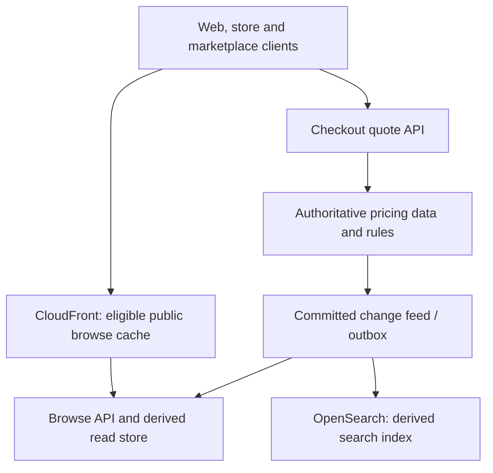

# Global catalogue and pricing: fast browsing, correct checkout

[Project index and working method](README.md) · [Programme Unit 3](../software-architect-grooming-programme-v5.html#day3)

## Frame and quantify

The brief specifies 150k peak reads/s, 2k updates/s, 99.99% browse availability, seconds-stale search, and correct checkout prices. Editing, search, pricing and checkout currently share a relational database, producing lock contention during campaigns.

Split public product content, search results, personalised offers, current price calculation and order acceptance. Clarify whether “correct price” means the current authoritative price or an explicitly honoured quote; define currency, market, tax and promotion scope. Assume here that checkout uses a versioned quote validated by the pricing authority and accepted under an explicit expiry/honour policy. Browsing cannot silently establish a purchase contract.

At an assumed 95% cache hit rate, 150k reads/s leaves 7,500 origin reads/s; at 80%, it leaves 30,000. This fourfold change is a sensitivity calculation, not an observed hit rate. It also excludes update/index traffic and checkout calls. A 99.99% time-based target allows about 4.32 minutes in a 30-day month; define eligible requests and the actual SLI rather than equating that figure to every customer's experience.

## Worked ADR: separate browse projections from price authority

**Decision:** publish derived browse/search views while retaining authoritative quote validation on the purchase path. **Alternative:** scale the single relational read path and add replicas. **Reason:** the read mix and freshness requirements differ; replicas alone do not isolate search/indexing or establish an acceptable stale-price policy. **Cost:** projection lag, invalidation and additional reconciliation. **Revisit:** if measured traffic and query isolation meet the targets with a simpler design, avoid adding a separate serving store.

AWS candidates include S3 for versioned public assets, DynamoDB for a predictable product-key read model, OpenSearch for search, and Aurora for authoritative relational pricing. Choose only the stores required by access patterns. CloudFront is not a correctness mechanism. Cache keys include every dimension that changes a cacheable representation; disable shared caching for user-specific responses unless isolation is proven. Verify cache policy TTLs as well as origin headers: a positive minimum TTL can override restrictive caching headers. See [CloudFront expiration controls](https://docs.aws.amazon.com/AmazonCloudFront/latest/DeveloperGuide/Expiration.html).

## Connect labs to evidence

| Preparation | Lab and transfer | Unit 3 artifact |
| --- | --- | --- |
| [Capacity model](../practice/README.md#worked-capacity-and-latency-model) | 04 CraftRoast (`l4`), **Cache forensics**: use product/market/version instead of only static files. | Capacity estimate and cache policy with hit-rate sensitivity. |
| [Reliability and failure control](../../../docs/system-design/reliability-and-failure-control.md) | 11 DataShift (`l11data`), **Scale and cache reads**: separate stale projection from authoritative checkout. | Request-path diagram and freshness SLO. |
| Queuing and overload | 02 LinkForge (`l2`), **Throttle drill**: transfer bounded concurrency to quote requests. | Failure-mode table, including origin overload and hot products. |

## Experiment: a campaign price changes during a cache outage

Use synthetic product `sku-a`, initially £10, then change the authoritative price to £12 at version 2. Delay projection delivery. A browse response may still show version 1 under the agreed policy; checkout must obtain/validate a quote and show the price it will actually accept. Submit an expired quote, replay an accepted request, and deliver version 1 after version 2. The projection must not regress, and a retry must not reprice an already accepted order silently.

Record source commit time, projection apply time, cache response version and final accepted price. Then disable the cache or model a cold-cache load step. Measure p95, origin traffic and rejected requests at a small declared test scale. Do not claim 150k reads/s from a laptop run or extrapolate linearly without quota, skew and bottleneck evidence. Define degradation explicitly: reduced browse features or bounded stale public content; no invented “current” quote if the pricing authority is unavailable.

## AI as a separately evaluated search enhancement

Semantic search or product-description drafting may improve discovery, but generated text must not become price, stock or promotion authority. Use DocuMind 13 (`l10`), **Tune retrieval**, with synthetic product descriptions and labelled relevance judgments. Compare keyword retrieval with semantic or hybrid candidates; measure recall/ranking, facet/market correctness and latency on held-out queries. Inspect rare products and exact identifiers, not only average relevance. Generation should cite product attributes and abstain from unsupported specifications. Keep authoritative offer values outside the model's control.

## Artifacts and oral defence

Complete a capacity estimate, request-path diagram, cache policy, failure-mode table and SLO definitions. Add the ADR above with your changed assumptions and observed results.

- **“Can I cache prices?”** Explain browse representation versus quote acceptance and the business freshness policy.
- **“What if invalidation is late?”** Describe version checks, bounded staleness and checkout authority; invalidation is not a transaction.
- **“Why is the origin overloaded despite scaling?”** Show hit-rate collapse, key skew, connection/query limits and load shedding before adding machines.

SAA lenses: high-performing reads, resilient overload handling and cache economics. Interview extension: quote semantics. Transfer accepted quote IDs into [omnichannel orders](omnichannel-orders.md).
