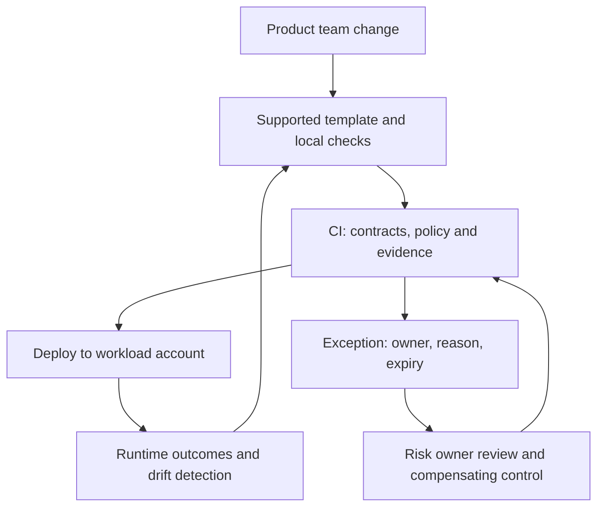

# Multi-team commerce governance: guardrails with evidence

[Project index and working method](README.md) · [Programme Unit 9](../software-architect-grooming-programme-v5.html#day9)

## Frame the operating model

Twelve product teams choose their own frameworks, event formats, observability and cloud patterns. Delivery is fast, incidents and integration costs are rising, and a monthly architecture board rejects designs too late. The central team is small; acquisitions add technology variety.

The goal is to preserve useful team autonomy while lowering cross-team risk. Distinguish mandatory safety/compatibility constraints from recommended implementation defaults. Start with evidence about recurring incidents, onboarding time, platform adoption and exception demand. Do not make a framework mandatory merely because the central team knows it.

## Worked ADR: supported paths plus time-bounded exceptions

**Decision:** offer supported service/event/deployment templates with a small set of automated controls; reserve early human review for high-impact decisions and exceptions. **Alternative:** require every design to pass a central board before implementation. **Reason:** common mistakes can be detected close to the change while specialised workloads retain a decision route. **Cost:** platform maintenance, compatibility commitments and transparent exception ownership. **Revisit:** revise a default when repeated justified exceptions or outcome evidence show it is a poor fit.

The loop is a proposed operating model, not a running platform. An exception is recorded evidence tied to a specific control/resource/revision; it is not a switch that bypasses all checks.

## Translate into AWS without confusing permissions and standards

AWS Organizations/accounts can separate workloads and ownership; SCPs constrain available permissions but do not grant them. IAM roles still need appropriate permissions. Config can detect selected resource drift; a pipeline can check infrastructure policies before deployment. These controls cover different failure stages. A schema registry documents contracts; it does not by itself prove consumer compatibility or business meaning. See [SCP semantics](https://docs.aws.amazon.com/organizations/latest/userguide/orgs_manage_policies_scps.html) and [EventBridge schemas](https://docs.aws.amazon.com/eventbridge/latest/userguide/eb-schema.html).

Use GitHub OIDC and scoped deployment roles from Lab 00 for the learning pipeline. Templates might offer Fargate and Lambda paths with shared identity, telemetry and cost-allocation conventions. Avoid a single mandatory compute platform until the workload constraints support it. Roll organisation-wide controls out to a test OU/account and assess recovery access before widening their reach.

## Five fitness functions with observable outcomes

| Constraint | Concrete check and failure | Owner / exception treatment |
| --- | --- | --- |
| Events stay compatible | Run a supported old consumer against the proposed producer payload; an incompatible required-field/type change blocks promotion. | Producing and consuming teams agree a version/migration plan. |
| Data boundaries stay private | Infrastructure policy rejects unapproved public data-store exposure; a runtime configuration check detects later drift. | Security owner approves narrowly scoped exceptions with compensating controls. |
| Important requests are traceable | A synthetic checkout trace must correlate API, worker and provider-operation reference without sensitive payloads. | Service owner supplies trace evidence; a missing required span/ID blocks release. |
| Recovery is executable | A canary rollout exercises rollback or a declared roll-forward procedure against seeded failure. | On-call owner accepts an explicit recovery bound and unresolved state policy. |
| Cost can be attributed | Validate capability/environment ownership metadata and report unallocated spend separately; compare cost per agreed business unit to its reviewed budget. | Product/platform owners review unexplained changes; a tag alone is not proof of complete attribution. |

Define thresholds, scope and data sources before enforcing them. For example, a synthetic trace check does not prove every production request is trace-complete. Monitor error budget, lead time and incident outcomes alongside check pass rates.

## Labs and artifacts

| Preparation | Exact lab transfer | Unit 9 artifact |
| --- | --- | --- |
| [Decision method](../../../docs/software-architecture/architecture-decision-method.md) | 00 (`p0`), **Register GitHub OIDC and scoped roles**, **Prove the pipeline**. | Governance operating model and review checklist. |
| Preventive versus detective control | 09 SecureLanding (`l9sec`), **Record and remediate configuration**. | Five fitness functions, their enforcement stages and exception records. |
| Workload-specific defaults | 05 FreshTrack (`l5`), **Break it on purpose**; 02 LinkForge (`l2`), **Throttle drill**. | Technology radar and team-boundary proposal based on operational evidence. |

## Experiment: a control that catches risk without blocking every change

Create a tiny producer/consumer fixture: the old consumer expects `orderId` as a string. Run it against a valid event, a version that changes the field type, and an additive optional field. Expected: compatible additions pass, the unsupported type change fails, and the failure names the impacted consumer. Then exercise one scoped exception with an expiry and a compensating compatibility adapter. An expired or wrong-resource exception must fail closed for that control; unrelated valid changes should still pass.

Record false positives and developer effort as well as caught faults. Deliberately change a resource after deployment in a sandbox to show why pipeline checks alone do not detect runtime drift. Preserve the governance decision and remediation timeline, not only a green screenshot.

## AI as an advisory reviewer

A policy/runbook assistant can retrieve applicable standards and draft a review comment. DocuMind 13 (`l10`) supports retrieval practice; OpsPilot 14 (`l11`), **Tools first, agent second**, supports bounded read-only inspection. The model cannot grant an exception, suppress a failing deterministic check or change account policies. Evaluate incorrect policy citations, stale standards, cross-team information access and prompt injection from repository text. Compare missed issues and reviewer correction time to the current review process. Keep versioned standards and human decision ownership visible.

## Defend it

Deliver the operating model, review checklist, technology radar, five fitness functions and team-boundary proposal. Include the compatibility/exception experiment and one reviewed trade-off.

- **“Is a golden path mandatory?”** Separate supported defaults from controls that address explicit shared risks.
- **“Can an SCP give my application access?”** It constrains permissions; it does not grant the role's required access.
- **“How do you know governance helps?”** Compare lead time, incident classes, integration rework, adoption and exception patterns—not meeting attendance.

SAA lenses: multi-account security and cost management. Interview extension: platform ownership and influence. Apply a small initial control set to [NorthStar](northstar-retail.md), sized to its six-month delivery window.
