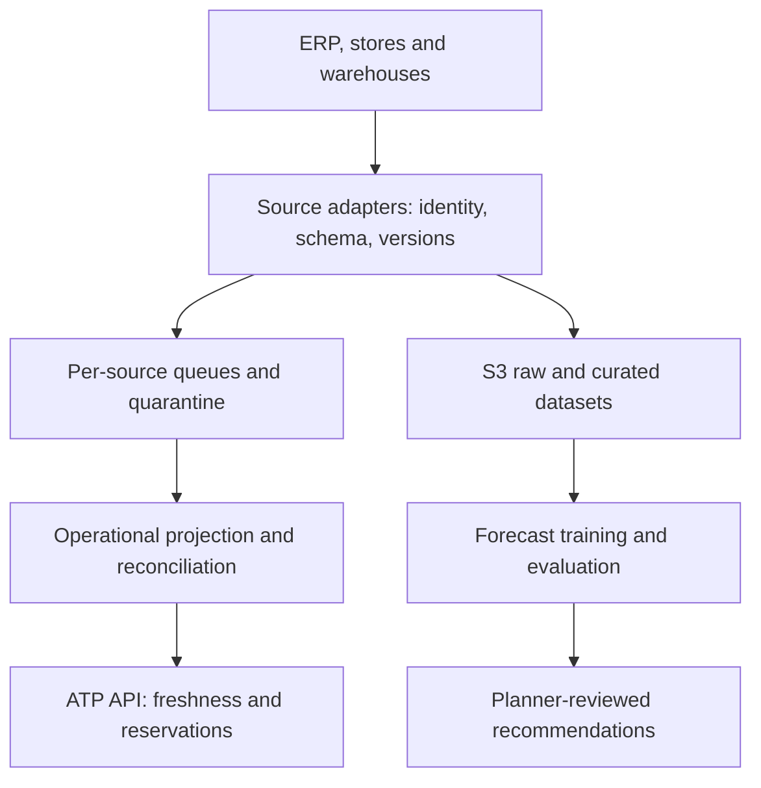

# Retail inventory intelligence: truth, projections and predictions

[Project index and working method](README.md) · [Programme Unit 5](../software-architect-grooming-programme-v5.html#day5)

## Frame the data problem

The brief spans hundreds of stores, distribution centres and online channels. Nightly ERP exports and store files produce stale available-to-promise (ATP) information. Events may arrive late or duplicate, stores disconnect, finance requires reconciled daily figures and channels need near-real-time availability. Demand forecasting is also required.

Separate four meanings: physical stock, stock allocated to reservations, the operational availability projection, and predicted future demand. Identify the authority for every SKU/location fact. For this slice, assume each source emits immutable event IDs and a per-SKU/location monotonic version; if a source cannot do so, define snapshot/reconciliation semantics rather than pretending timestamps give a total order.

ATP is a business formula, not simply the latest inventory row. A teaching formula is `sellable on-hand − active reservations − safety allocation`; define what “sellable” and each allocation mean and avoid subtracting a reservation twice if the source already includes it. Forecasts may inform reviewed safety allocations; they do not create stock.

## Worked ADR: separate operational and analytical serving

**Decision:** build a reconciled event-fed operational projection plus a replayable analytical lake. **Alternative:** query replicas of the ERP for both channel reads and analyst exploration. **Reason:** operational freshness and analytical scan workloads differ. **Cost:** version handling, replay controls and reconciliation become owned services. **Revisit:** if sources cannot support trustworthy incremental updates, retain explicitly stale snapshots while improving the source contract; do not advertise near-real-time correctness from nightly files.

AWS candidates: SQS for isolated buffered adapters; DynamoDB conditional writes/transactions for key-based projection/version changes; S3, Glue and Athena for analytical data; SageMaker training and batch inference for forecasting. A high-volume ordered-stream requirement may justify Kinesis; it is not needed simply because records are called events. Delivery to operational and analytical paths must be replayable from a durable source/outbox rather than an unprotected dual write.

[DynamoDB transactions](https://docs.aws.amazon.com/amazondynamodb/latest/developerguide/transaction-apis.html) can atomically update related items within their documented scope. They do not order external source events or make the physical stock count correct. Keep a version check, event identity and source reconciliation policy.

## Map learning to artifacts

| Preparation | Exact lab transfer | Unit 5 output |
| --- | --- | --- |
| [Data/workflow ownership](../../../docs/cross-cutting-patterns/durable-workflows-and-idempotency.md) | 03 OrderFlow (`l3`), **Duplicate drill**; 11 DataShift (`l11data`), **Stream NoSQL changes**. | Data-domain map and source-to-serving flow. |
| Analytical isolation | 07 StreamSight (`l7`), **Upgrade to Parquet**, **Partition pruning proof**, **Workgroup guardrail**. | Schema/partition rules, analytical scan-cost evidence. |
| [AI assurance](../../../docs/ai-architecture/production-ai-assurance.md) | 12 SageStart (`l9`), **Train the defect model**, **Score with batch transform**: reuse the training/inference lifecycle, replace its classification task with a forecasting experiment. | Forecast validation and model/data version record. |

SageStart's defect classifier is not a ready-made demand forecast. You must supply a time-indexed dataset, forecasting target, baseline and appropriate evaluation.

## Experiment: replay must not invent availability

Use absolute synthetic snapshots for one SKU/location: version 1 has on-hand 10; version 2 has 7. Deliver `v1, v2, v2, v1`. Expect the final projection to remain version 2 with 7 units, not 4 or 10. Add an active reservation of 2 under a separate reservation authority; with zero safety allocation the teaching ATP is 5. Replaying either source must not subtract those 2 again.

Next try **delta** events instead of snapshots. Explain why simply discarding a lower version can lose a required delta when a version is missing. Detect a gap, buffer/quarantine or request a source snapshot, then reconcile. Disconnect the source; record both event-to-projection delay and time since last source contact. A fast consumer processing old data is not fresh inventory. Define how stale locations are excluded or conservatively allocated for customer promises.

Keep raw inputs, expected/actual projection, gap handling, reconciliation differences and timestamps. Then run the chosen AWS drills at a stated scale. A small replay test validates semantics, not national ingestion capacity.

## Forecasting depth worth defending

Start with a seasonal-naive forecast, such as the same weekday from the previous week, before a learned model. Use rolling time splits and features available at prediction time. Stockouts censor observed sales; returns, promotions and newly introduced products need explicit treatment. Random train/test splitting can leak future patterns.

Report MAE and an agreed aggregate measure such as WAPE, including zero-demand handling and per-store/SKU slices; assess prediction intervals and the operational cost of over/understock. Compare against the baseline over multiple forecast origins. Keep replenishment approval outside the model for the first pilot. A generative analyst assistant may explain approved results with citations, but it cannot quietly alter quantities or overwrite the forecast dataset.

## Defend it

Complete the data-domain map, source-to-serving flow, schema rules, freshness SLOs and data-quality controls. Add the replay trace and a forecast baseline comparison as separately labelled evidence.

- **“Why not trust event time?”** Clock skew and lateness differ from source sequence and business authority.
- **“Why did the forecast improve but stockouts rise?”** Evaluate action policy, bias by product/store, censored demand and operational outcomes.
- **“Does eventual consistency permit overselling?”** The projection informs a promise; the authoritative reservation policy must enforce its allocation limits.

SAA lenses: data access patterns, decoupling, storage lifecycle and analytical cost. Interview extension: event semantics and ML evaluation. Carry the authority/freshness contract into [NorthStar](northstar-retail.md).
