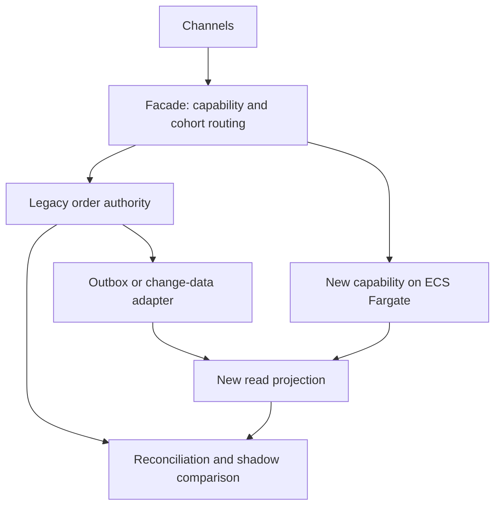

# Legacy order management: migrate the writer, not just the code

[Project index and working method](README.md) · [Programme Unit 7](../software-architect-grooming-programme-v5.html#day7)

## Frame the first increment

The source brief has a 15-year-old Java order platform, three million lines, a shared Oracle schema, batch integrations, eight-week releases and limited tracing. It needs new fulfilment capabilities within 18 months, with no big-bang outage, mixed on-prem/cloud connectivity, a skills gap and a fixed budget.

Start with a capability and dependency assessment: which process owns orders, which systems write the shared tables, which batch jobs mutate state, and where can requests be routed reliably? Assume the first increment is inventory visibility/order promise, initially read-only. Do not select an extraction seam only because its classes form a convenient package.

## Worked ADR: a facade plus an explicit authority handover

**Decision:** route a bounded capability through a facade, shadow the new read model, then move one cohort under a controlled ownership rule. **Alternative:** lift the whole application to cloud infrastructure first and improve deployment/observability before extraction. **Reason:** a capability pilot can demonstrate business value while containing coexistence risk. **Cost:** temporary routing, data translation and reconciliation complexity. **Revisit:** if the seam cannot be isolated or source access is unreliable, improve the existing platform and its contracts before forcing extraction.

This drawing is the read-only coexistence phase. It does not give both systems permission to write the same order. A later write cutover needs a separate sequence: quiesce/drain the chosen cohort, reconcile to an agreed watermark, fence the old writer, switch routing/authority, verify, then admit new commands. If new writes have occurred, reverting DNS or routing alone is not a data rollback.

AWS candidates include an ALB/API facade, Fargate for the extracted service, Aurora or DynamoDB for its owned data, and an explicit hybrid network/DNS path. DMS full load plus CDC may help move supported database data; row replication does not infer business events, repair semantics or enforce single ownership. Validate source/target support and operational impact. Use [AWS strangler-fig guidance](https://docs.aws.amazon.com/prescriptive-guidance/latest/cloud-design-patterns/strangler-fig.html) and [DMS validation documentation](https://docs.aws.amazon.com/dms/latest/userguide/CHAP_Validating.html) as mechanisms to investigate, not evidence that your migration is safe.

## Connect labs to migration artifacts

| Preparation | Exact lab transfer | Unit 7 artifact |
| --- | --- | --- |
| [Decision method](../../../docs/software-architecture/architecture-decision-method.md) | 05 FreshTrack (`l5`), **App + local loop**, **Pipeline: plan on PR, apply on merge**. | Capability assessment, target architecture and first extraction design. |
| Hybrid failure boundaries | 10 HybridHub (`l10net`), **Model the hybrid choices**, **Run routing fault drills**. | Coexistence deployment/network view and risk register. |
| Data movement versus authority | 11 DataShift (`l11data`), **Execute or model a migration**. | Strangler roadmap and cutover/reconciliation evidence. |
| [Reliability](../../../docs/system-design/reliability-and-failure-control.md) | 08 VaultGrade (`l8`), **THE DRILL**. | SLOs, recovery steps and tested rollback limits. |

## Experiment: stale traffic reaches the old writer after cutover

Build two tiny synthetic order stores and a facade with an explicit cohort/ownership version. In shadow mode, send commands only to the legacy writer and compare derived results without side effects. Delay replication and show that the cutover gate rejects a lagging target. After reconciling, transfer authority for cohort A and send a stale-routed write directly to the old service. It must reject/forward according to the ownership contract; the facade alone cannot fence bypassing clients or batch jobs.

Write an order through the new owner, then request rollback. Expected: an explicit pause and reconciliation/reverse-transfer procedure, not loss of the new order. Stop and restart the adapter, replay an event, and prove no duplicated business effect. Record watermarks, mismatch counts, denied stale writes, request results and the duration of the handover. The local experiment proves the protocol you built; it does not prove Oracle/DMS compatibility or production network behaviour.

Define SLOs for the new path and the coexistence path. Correlate traces across the facade and adapters; do not claim improvement from faster deployment alone if order correctness or user latency regresses. Attribute temporary double-running, replication, observability and transfer costs to the migration budget.

## AI assistance with verifiable outputs

AI can draft dependency summaries, proposed tests or ADRs from approved code/contracts. Prefer deterministic static/runtime analysis as the evidence base. Use DocuMind 13 (`l10`) for a synthetic contract/runbook corpus; test unsupported dependency claims and stale contract versions. Keep code and client data within approved handling boundaries. AI does not choose the authoritative writer, execute a cutover or approve a migration. Measure reviewer corrections and whether generated tests detect seeded faults, not lines of generated code.

## Defend it

Deliver the capability assessment, target architecture, strangler roadmap, first extraction, SLOs and migration risk register. Add a cutover sequence, rollback boundary and executed authority-fencing trace.

- **“Why not rewrite everything?”** Explain value sequence, unknown dependencies, team capacity and coexistence cost.
- **“We have CDC; is migration complete?”** Data arrival is distinct from contract compatibility, reconciliation and writer authority.
- **“Can we roll back instantly?”** Code rollback and data/ownership rollback have different preconditions once new writes exist.

SAA lenses: hybrid connectivity, migration mechanisms, availability and cost. Interview extension: sequencing and operational ownership. Apply the same evidence to the six-month first capability in [NorthStar](northstar-retail.md).
