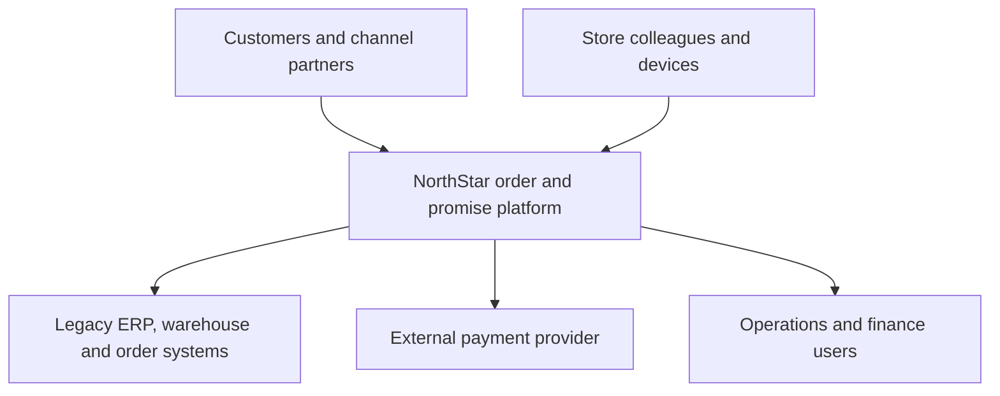
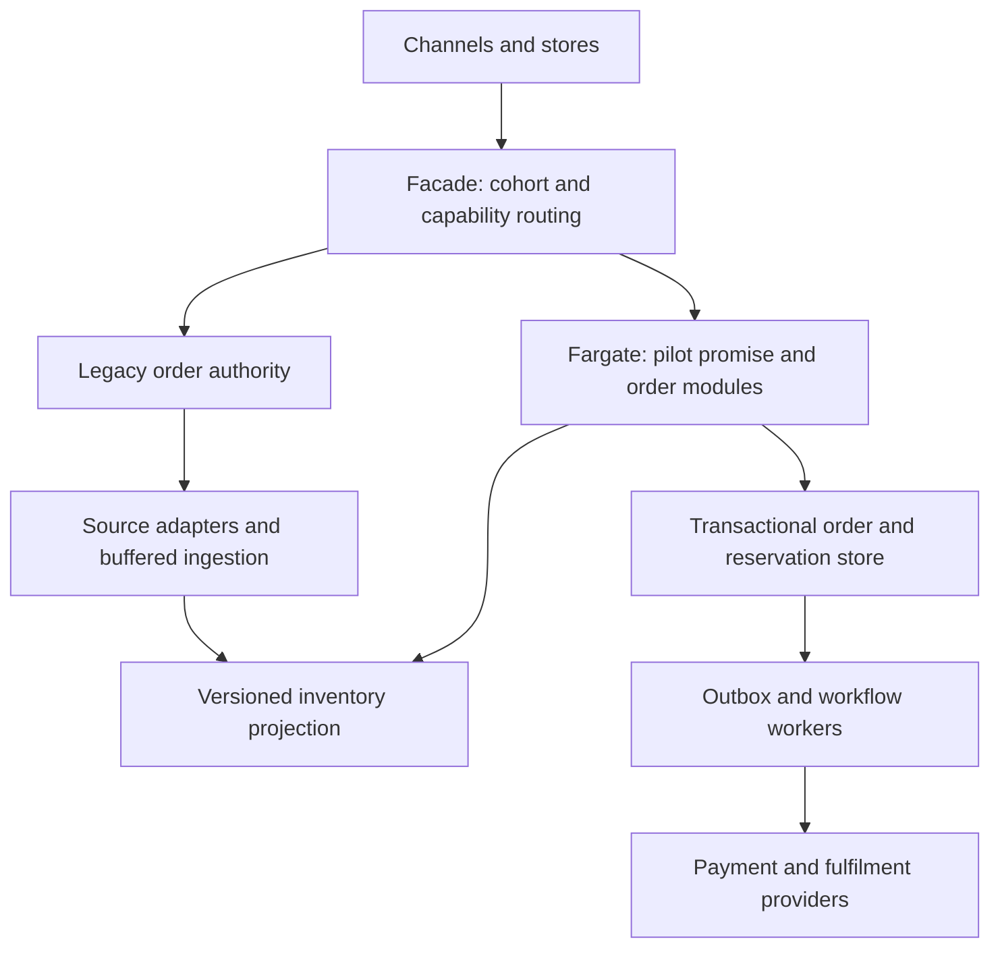

# NorthStar Retail: connect the complete architecture engagement

[Project index and working method](README.md) · [Unit 10 workshop](../software-architect-grooming-programme-v5.html#day10) · [Full capstone brief](../software-architect-grooming-programme-v5.html#capstone)

## Preserve the actual brief

NorthStar is a fictional composite with 420 stores, 8 distribution centres, ecommerce, mobile and marketplaces. Inventory arrives in 15-minute batches, the order platform is 17 years old, and releases take eight weeks. The brief seeks 60% fewer cancellations caused by inaccurate availability, order-promise p95 below 300 ms during normal operation, and two hours of store trading during disconnection. The first capability is due in six months, modernisation in 18 months; Black Friday may reach 12× normal peak. Ordering RTO is 30 minutes and order-state RPO is 5 minutes. These are pedagogical brief targets, not measured capabilities.

Do not combine the individual project companions by copying all their services. NorthStar needs one coherent authority model, migration sequence, capacity model and operating team.

## Unit 10 mobilisation workshop

Use the ambiguous brief to organise discovery before choosing services. Produce the unit's assumption log, stakeholder questions, quality scenarios, work plan, review calendar and first context diagram.

| Item | First entry to work through |
| --- | --- |
| Fact | Store connectivity can fail for two hours; inventory events may be late, duplicated or out of order. |
| Assumption to validate | The initial pilot can assign exclusive sellable allocations to named channels/locations. |
| Conflict | “Always accept orders” conflicts with accurate promises when the remaining authoritative stock is unavailable. |
| Decision owner | Retail operations owns offline trading policy; inventory/order owners approve allocation and reservation semantics; finance owns reconciliation. |
| First risk | Two independently operating channels promise the same last unit. |
| First experiment | Concurrent online reservation against a store's offline allocation, followed by reconnection/replay. |

Ask the stakeholders: What counts as a cancellation caused by bad availability? What is the baseline and measurement period? Which SKUs/stores are in the pilot? Who writes stock today? Are reservations already reflected in ERP balances? How are returns/damages represented? Which payment actions have provider idempotency? What can an offline store sell? Who accepts stale promises? Which datasets and dependencies are covered by RPO/RTO? What normal peak produces the 12× campaign target? Which releases or batch jobs bypass the facade? What first-year budget and on-call capacity are available?

Agree effort/timeboxes and review checkpoints for framing, options, failure evidence, cutover readiness and final defence. Record participants and the decision each checkpoint enables. Escalate an unresolved high-impact assumption instead of quietly treating it as approved.

This context view deliberately has no cloud services. Use the deployment view to explain implementation later.

## Compare two viable first increments

| Option | What changes first | Advantages | Costs and evidence needed |
| --- | --- | --- | --- |
| A: strengthen the legacy core and add visibility | Improve releases/telemetry; build read-only inventory/promise visibility while retaining order writes. | Lower authority-transfer risk and immediate operational learning. | Legacy limits may constrain promise latency; prove the read model's source quality and query isolation. |
| B: facade plus bounded order/promise extraction | Build a pilot inventory projection and promise capability; transfer a defined cohort's reservation/order authority when readiness is proven. | Earlier domain ownership and independently changeable pilot capability. | More coexistence, fencing and reconciliation work; prove no double writer and recoverable cutover. |

**Worked ADR NS-001:** prefer B as the target first increment, staged through A's read-only shadow phase. The reason is the need for new fulfilment options within the timeline, while the no-big-bang constraint requires staged proof. Accept temporary double-running cost. Revert to an extended A phase if source identity/version quality, writer fencing or team operating capacity fails the gate. Neither a weighted matrix nor the deadline can override a correctness failure.

## Assemble a small AWS target from proven decisions

For a candidate deployment, use Aurora for relational order/reservation/outbox transactions and DynamoDB for a key-based inventory read projection if measurements justify two stores. SQS buffers isolated adapters; Step Functions can coordinate the critical order workflow. Fargate fits a containerised pilot; Lambda is an alternative where short bursty functions and team skills fit better. Add S3/Glue/Athena analytics separately from the order path. Start with one Region and multi-AZ application/database deployment; design a recovery topology that can actually meet the brief's RTO/RPO. A diagram with two Regions is not a recovery test.

The arrows from legacy and pilot represent **different explicitly owned cohorts/capabilities**. They do not permit competing writers for one order. Use the migration companion's ownership handover protocol. Do not use stale stock or a forecast as an authoritative reservation ledger.

## Trace requirements to artifacts and experiments

| NorthStar requirement | Decision to reuse | AWS lab transfer | Evidence / capstone output |
| --- | --- | --- | --- |
| Correct availability and fewer cancellations | [Inventory authority/versioning](inventory-intelligence.md) | 03 OrderFlow; 11 DataShift | Source-quality/replay evidence; data architecture; measured cancellation baseline. |
| Promise p95 below 300 ms | [Separate read and purchase paths](catalogue-and-pricing.md) | 04 CraftRoast; 11 DataShift | Path budget, freshness policy and load results; quality scenarios and views. |
| Two-hour store disconnection | Bounded offline allocation with reconciliation | 03 OrderFlow duplicate/replay techniques | Allocation protocol, local competing-reservation test and operator runbook. |
| Partial fulfilment and provider failures | [Explicit order state and compensation](omnichannel-orders.md) | 03 OrderFlow; 06 ClipPress replay techniques | State machine, sequences, contracts, unknown-outcome evidence. |
| Six/18-month delivery without big bang | [Facade, shadow reads and fenced cutover](legacy-modernisation.md) | 05 FreshTrack; 10 HybridHub; 11 DataShift | Migration phases, cohort ownership and cutover/rollback evidence. |
| Security and financial reconciliation | [Refund/ledger authority](wallet-and-refunds.md) | 09 SecureLanding; 08 VaultGrade | Threat model, deny tests, reconciliation and recovery evidence. |
| Monthly cost by capability | [A small set of governance controls](commerce-governance.md) | 00 CI/CD Spine; 07 StreamSight | Cost model, allocation gaps, fitness functions and accountable owners. |

Use the exact lab IDs/titles in the [index](README.md#locate-the-aws-labs-accurately). The table maps practice to the case; it does not claim those lab exercises implement NorthStar already.

## Two material-risk experiments

**Experiment 1 — online/offline allocation and duplicate correctness.** Use a synthetic SKU with physical on-hand 10. Assign 3 exclusively to a store's offline selling authority and 7 to the online authority. During disconnection, attempt 4 store sales and 8 online reservations concurrently. Under this teaching policy, at most 3 and 7 respectively may succeed; depleted allocations reject or defer additional requests. Reconnect, duplicate sale events and deliver older versions late. Reconciliation must preserve the 10-unit bound without applying sales twice. If connectivity remains absent after two hours, the store's policy must stop/degrade as agreed; the online side cannot safely reclaim an allocation merely because its lease time passed while the store may still spend it. Reallocation requires reconciliation or enforceable fencing acknowledged by the relevant authority.

Adapt the existing [reservation lab](../practice/reservation-lab.py) or build an equivalent fixture with separate allocation scopes. The unchanged sample has one stock pool and no offline allocation protocol. Record which implementation changes make this experiment project-specific, then attach predictions, outputs and a design revision.

**Experiment 2 — recover ordering and its dependencies.** Start with a synthetic accepted order with a pending external effect. Fail the serving environment, restore/fail over using the proposed topology, re-establish identity, KMS/secrets, routing and provider access, then reconcile before resuming writes. Measure elapsed user-visible outage and identify the latest recovered committed order watermark. Compare with 30-minute RTO and 5-minute RPO, including the possibility that a provider completed an action absent from the restored database. Prove retries do not duplicate that effect. VaultGrade/DataShift provide mechanisms to practise; if only a local drill is run, label the AWS recovery objective unproven. The second experiment may instead target migration or contracts, but must address a different material risk from Experiment 1.

## Integrate AI without confusing prediction and authority

Use [inventory forecasting](inventory-intelligence.md) for planner-reviewed demand/safety-stock recommendations and an authorised operational assistant for event/runbook explanations. They are optional to order acceptance. Establish a non-AI baseline, time-split forecast evaluation, held-out retrieval cases and explicit failure/degraded behaviour. No model can create stock, override a reservation limit, approve a refund or initiate a cutover. An agentic extension needs narrowly scoped tools, explicit authority and idempotent effects; begin with read-only inspection.

## Complete all eleven capstone deliverables

| # | Deliverable | What this evidence pack must contain |
| --- | --- | --- |
| 1 | Executive framing | One-page outcome, scope, baseline, unknowns and staged value. |
| 2 | Stakeholders and qualities | Named concern owners, utility tree and at least eight full measurable scenarios. |
| 3 | Domain/capability model | Order, inventory, promise, payment, fulfilment, returns, product and seller authority. |
| 4 | Architecture views | Context/container, two dynamic views, deployment and coexistence; stable names/contracts. |
| 5 | Decision records | At least six: increment/seam, inventory authority, offline allocation, order coordination, recovery, and security/governance. Each has alternatives, downside and trigger. |
| 6 | Workflow | Reservation, partial fulfilment, idempotency, expiry, compensation and manual recovery. |
| 7 | Data | Source contracts, events, projections, reconciliation, analytics and retention. |
| 8 | Security/resilience | Trust boundaries, identity, abuse/deny paths, degradation and measured/unproven RTO/RPO. |
| 9 | Migration/operations | Phases, ownership handover, rollback limits, SLOs, fitness functions, costs and risks. |
| 10 | Defence | 15-minute narrative plus at least 15 minutes of challenge/evidence inspection, extended when needed. |
| 11 | Executed evidence/revisions | Two different material risks tested; at least one adapted/project-specific implementation; results, limitations and a revision after review. |

Suggested phases follow the brief: shadow visibility and a bounded pilot within the first six months; expand proven cohorts/capabilities across the remaining programme to month 18, with explicit gates rather than assumed progress. Model costs for coexistence, data transfer, replicas, logs and AI as well as compute. Derive the 12× load from a measured normal peak and realistic skew; do not import Unit 3's load numbers.

## Final interview challenge

Explain the same evidence three ways: business value and phased risk to an executive; authority, transactions and failure traces to an engineer; evaluation, model boundaries and rollback to an AI/platform interviewer. Then answer: **“The store remains offline after its allocation is exhausted, and the business asks you to keep accepting orders. What changes?”** A defensible answer exposes the business risk and alternatives; it does not invent a consistency guarantee.

Use the [existing assessment rubric](../software-architect-grooming-programme-v5.html#assessment). Diagrams, planned AWS drills and completed reading do not satisfy executed-evidence gates. The AWS service candidates above are reasoned proposals; production choices require current regional capability, price, quota and recovery validation.
