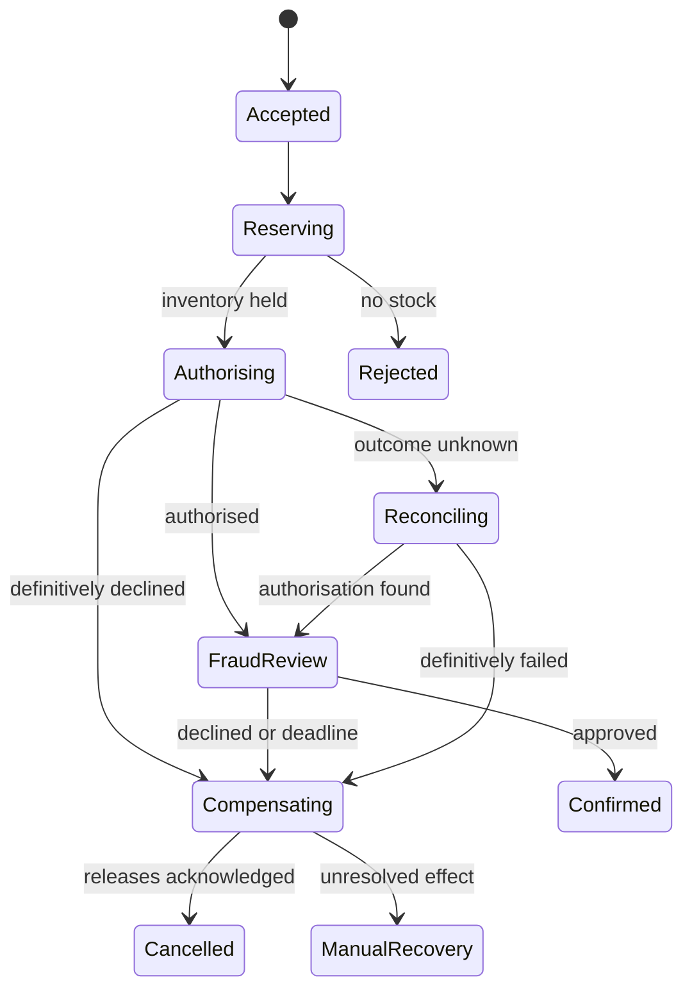

# Omnichannel orders: defend the failure paths

[Project index and working method](README.md) · [Programme Unit 4](../software-architect-grooming-programme-v5.html#day4)

## Frame the workflow

The brief combines home delivery, click-and-collect and ship-from-store. Seven synchronous dependencies cause checkout failure; payment, inventory, fraud and fulfilment are separate authorities. Stores can be offline, messages can duplicate, and partial fulfilment is allowed.

Distinguish **request accepted** from **order confirmed**, and fulfilment-line state from overall order state. Clarify the payment authorisation/capture policy, reservation expiry, cancellation rights and ownership of offline stock. The teaching design uses reservation and payment authorisation before confirmation; capture timing follows an explicit business/provider contract. It does not assume a distributed transaction with the payment provider.

## Worked ADR: explicit orchestration for the first critical workflow

**Decision:** use a durable orchestrated workflow for reservation → payment authorisation → fraud decision → confirmation, with explicit recovery states. **Alternative:** events and choreography between independently reacting services. **Reason:** the current pain is invisible partial state and manual repair; an explicit coordinator makes deadlines and recovery ownership reviewable. **Trade-off:** coordinator/version management and service coupling through the workflow contract. **Revisit:** autonomous side effects such as analytics can subscribe to facts without joining the critical coordination path.

This state diagram shows the initial order decision. Design line-level fulfilment/capture/refund transitions separately; a partially shipped order cannot be “rolled back” as if nothing happened.

Before confirmation, revalidate that the inventory reservation and payment authorisation are still usable under their respective owners' expiry rules. A long fraud review or reconciliation can outlive either hold. If a hold has expired, follow an explicit re-reservation/re-authorisation or cancellation policy; a late success callback must not revive an already released allocation automatically.

## AWS implementation and technical seams

API Gateway/Lambda or ALB/Fargate validates an idempotent order command, commits its accepted state and outbox, then starts a Step Functions Standard workflow through a retryable dispatcher. Dispatch retries must preserve the same business order and be reconciled; creating an execution is another external boundary. Workers call the inventory and payment APIs with stable operation IDs. SQS isolates downstream notifications and adapters. The workflow is not the only source of business truth: order and provider state need explicit ownership and reconciliation.

Step Functions supports [retry and catch controls](https://docs.aws.amazon.com/step-functions/latest/dg/concepts-error-handling.html). Configure transient retries, bounded timeouts and failure transitions; this does not make external effects exactly once. A compensation is another fallible business action, with its own ID, deadline and evidence. Assign an operator queue for unresolved releases/refunds rather than an unbounded retry loop.

## Connect labs to the required outputs

| Preparation | Exact AWS lab transfer | Artifact |
| --- | --- | --- |
| [Durable workflows and idempotency](../../../docs/cross-cutting-patterns/durable-workflows-and-idempotency.md) | 03 OrderFlow (`l3`), **Duplicate drill**, **Poison drill**, **Add the saga**. | State machine and event/API contracts. |
| [Local transaction experiment](../practice/reservation-lab.py) | Adapt single-item reservation to a named SKU/location and bounded reservation lifetime before AWS. | Concurrency evidence and happy-path sequence. |
| [Reliability](../../../docs/system-design/reliability-and-failure-control.md) | 06 ClipPress (`l6`), **Failure + replay drill**: transfer replay reasoning, not media infrastructure. | Unknown-outcome and compensation sequences; recovery runbook. |

## Experiment: the order you cannot safely retry blindly

Use a synthetic inventory of one unit and two competing order IDs. Confirm at most one reservation. For the winner, make the provider authorise then drop its response. Restart the coordinator, query the provider by operation ID, and confirm that no second authorisation is created. Next return a fraud decline and fail the first inventory-release attempt. Expected final result: cancellation only after release is confirmed, or an explicit manual-recovery state while release is uncertain.

Write three sequences: success; authorisation timeout and reconciliation; decline with compensation failure. For a two-line order, repeat with one line unavailable and state which partial fulfilment policy applies. Capture provider-call counts, remaining stock, reservation expiry, order state and recovery age. Show how late success callbacks are handled after a cancellation decision. A database rollback cannot undo a previously sent shipment or a provider capture.

## AI as operational assistance

An assistant can assemble an incident timeline or draft a customer-service explanation from authorised order events and runbooks. Use DocuMind 13 (`l10`); use OpsPilot 14 (`l11`) only to study read-only tool contracts. The model cannot confirm delivery, release stock or refund money. Test duplicate/out-of-order events, conflicting provider facts and a malicious note embedded in a tool result. Require source references for status claims, abstention on unknown outcomes and operator review. Evaluate factual event ordering and time saved against a deterministic timeline; fluency is not a correctness score.

## Defend it

Submit the state machine, three sequence diagrams, contracts, coordination ADR and recovery runbook required by Unit 4, with executed evidence attached.

- **“Why not one database transaction?”** Identify separately owned external effects and the limits of local atomicity.
- **“Does compensation restore the past?”** It creates new business actions; some effects are irreversible or only partly reversible.
- **“What does a customer see after a timeout?”** A durable pending/unknown state with a status lookup, not a false failure or confirmation.

SAA lenses: resilient asynchronous design and secure service access. Interview depth: state transitions, business idempotency and operator recovery. Continue with [inventory intelligence](inventory-intelligence.md) for the availability facts those decisions depend on.
