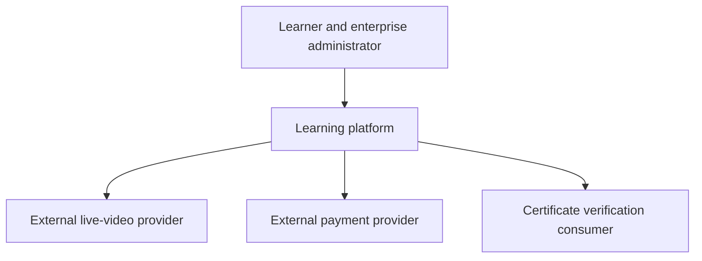

# Professional learning platform: views that agree

[Project index and working method](README.md) · [Programme Unit 8](../software-architect-grooming-programme-v5.html#day8)

## Frame the communication problem

The brief includes courses, live cohorts, assessments, certificates, payments and enterprise reporting. B2C and enterprise customers share a platform, but teams disagree about boundaries. One diagram mixes classes, cloud icons, journeys and deployment; decisions are lost in chat. Constraints include distributed teams, external video/payment providers, regulated certificates and documentation maintained with code.

For the first slice, follow purchase → entitlement → assessment → certificate. Establish who owns curriculum versions, eligibility, assessment results and certificate issuance/revocation. Enterprise tenant boundaries must govern queries and reports; a login claim alone is not an entitlement to every course or organisation's learners. Clarify certificate assurance and retention requirements with their owners instead of assuming that every certificate has the same rules.

## Worked ADR: entitlement and assessment are explicit domain authorities

**Decision:** maintain separate modules/contracts for payment status, learning entitlement, assessment result and certificate issuance, initially deployable in one backend. **Alternative:** one purchase flag that unlocks learning and directly triggers a certificate. **Reason:** purchase, learning completion and an authoritative pass are different facts with different lifecycles. **Cost:** explicit transitions and reconciliation. **Revisit:** separate deployments when operational or team boundaries justify them; the domain distinctions remain even inside a monolith.

This is the **context view**: people and external systems, not a deployment claim. Build a container view with browser UI, backend, background worker and data stores. Use a separate deployment overlay to map them to CloudFront/S3, ALB/Fargate or API Gateway/Lambda, Aurora and SQS. A C4 container is a running application/data store boundary, not necessarily a Docker container. See the [C4 model's view definitions](https://c4model.com/diagrams).

## Three views, one trace

Choose one operation ID and keep the names consistent across views. In the dynamic view: validate an assessment attempt against the course/rubric version and learner entitlement; commit the authoritative result and an outbox event; let a worker issue a certificate only when prerequisites are met. Deduplicate issuance by the agreed learner/course/award identity. A retry must not mint another independent award. Revocation is an explicit lifecycle event with a verifiable current state, not deletion of evidence.

In the deployment view, show private database access, task roles, tenant policy enforcement, provider callbacks and public certificate verification boundaries. Public verification must disclose only approved fields. For recordings, private S3/CloudFront delivery and short-lived signed access are candidates; URL expiry does not by itself implement enrolment revocation. Use the external video provider for live sessions unless there is a requirement to host that capability yourself.

## Connect labs to Unit 8 artifacts

| Preparation | Exact lab transfer | Artifact |
| --- | --- | --- |
| [Programme communication](../software-architect-grooming-programme-v5.html#day8) and [decision method](../../../docs/software-architecture/architecture-decision-method.md) | 05 FreshTrack (`l5`), **App + local loop**: map running components back to container names. | C4 context/container views and deployment overlay. |
| Private content delivery | 04 CraftRoast (`l4`), **Distribution + OAC**; extend its public storefront pattern with an entitlement check and controlled media access. | Access-policy ADR; do not mistake OAC for learner authorisation. |
| Durable issuance | 03 OrderFlow (`l3`), **Duplicate drill**; 06 ClipPress (`l6`), **Failure + replay drill** only if recorded-media processing is in scope. | Assessment-to-certificate dynamic view and issuance ADR. |

## Experiment: a duplicate pass event and a revoked entitlement

Use a synthetic learner and course version. Deliver the same authoritative pass event twice; expect one certificate identity. Deliver a forged/unauthorised event and a pass for an incompatible assessment version; neither may bypass validation. Decide what happens when entitlement is revoked between attempt start and submission: the rule needs an owner and effective time, not an accidental implementation order.

Then give the context diagram to a product reviewer and the dynamic/deployment views to an engineer. Ask each to trace who can issue or revoke an award. A diagram review fails if a component changes name or authority between views, or if a call appears without an API/event contract. Record the contradictions they find and revise the drawings. This is review evidence; label the duplicate-issuance implementation test separately.

## AI with a formative learning boundary

A tutor may retrieve approved course content and draft feedback; it does not become the authority for a regulated pass or certificate. Start with DocuMind 13 (`l10`), **Tune retrieval**, using synthetic course excerpts and course/version/tenant metadata. Test wrong-course retrieval, obsolete material, unsupported feedback and attempted answer leakage for restricted assessments. Enforce permissions before context reaches the model, including cited-source access.

Compare grounded feedback against an instructor-reviewed rubric and a non-AI reference response. Measure corrections, source accuracy, abstention and latency; keep held-out learner questions. Personalise explanations without silently changing the assessment standard. If assessment automation is proposed later, it needs its own validity, accessibility and assurance review.

## Defend it

Produce the required context/container views, one dynamic view, three ADRs (domain authority, entitlement/delivery, certificate lifecycle) and a diagram checklist. The checklist covers audience, scope, legend, stable names, trust boundaries, contracts, ownership and the source revision.

- **“Which diagram goes to an executive?”** Start with outcomes/context; offer deployment detail only when it informs their decision.
- **“Why separate purchase from entitlement?”** Refunds, sponsorship, enterprise licences and suspensions evolve differently from payment state.
- **“Why can't the tutor issue certificates?”** Feedback quality and authoritative assessment/issuance have different evidence and authority requirements.

SAA lenses: secure content delivery, application/data boundaries and asynchronous processing. Interview extension: communicating consistent architecture to different audiences. Use [governance](commerce-governance.md) to keep these views and contracts maintained across teams.
