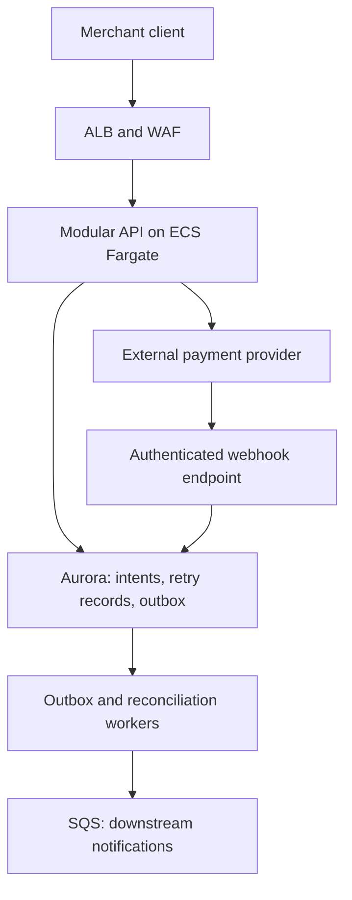

# Regulated payments startup: boundaries before microservices

[Project index and working method](README.md) · [Programme Unit 2](../software-architect-grooming-programme-v5.html#day2)

## Frame the decision

The brief gives a five-person engineering team, a 16-week launch, the first 200 merchants, uncertain growth, limited operations experience and two people on call. The outcome is a fast launch that can pass its security review and evolve. Minimise card-data scope and preserve an audit trail.

For this teaching slice, assume a payment provider hosts card collection and exposes sandbox authorise/capture/refund APIs. Your application stores provider references and payment intent state, not raw card details. This is a scope-reduction design hypothesis, not a compliance determination. Clarify settlement responsibilities, jurisdictions, currencies, provider idempotency/reconciliation guarantees, traffic and incident ownership with the relevant specialists before approving a production design.

**Invariant:** one merchant-scoped business intent must not cause a second capture on retry. A provider timeout means the outcome may be unknown; it does not prove that the provider did nothing.

## Worked ADR: one deployable core with explicit modules

**Context:** 16 weeks and a small on-call team favour a limited number of operational components. **Decision:** begin with modules for merchant access, payment intents, provider integration and reconciliation inside one backend; use separate worker execution where failure isolation requires it. **Alternative:** independently deployed payment, merchant and reconciliation services. **Consequence:** the first option reduces deployment coordination but shares a release/blast radius. **Revisit:** measured independent scaling needs, repeated module-induced incidents or stable independent team ownership justify extraction. Merchant count alone does not justify microservices.

Score the two options against delivery effort, recoverability, auditability, security boundary and operating burden. Apply hard constraints before weighted scores: an option that exposes card data or cannot reconcile unknown captures cannot win through low cost.

## Translate into AWS

Tasks run in private subnets across AZs, with explicit outbound connectivity to the provider and scoped IAM/secret access. An API Gateway/Lambda backend is a credible alternative for short bursty calls; compare connections, timeouts, library fit and workload cost. Aurora is a candidate for transactional intent/result/outbox records, not an automatic requirement for all payment systems.

The provider call is outside the database transaction. Persist the intent and stable operation ID, use the provider's idempotency contract, and reconcile uncertain results. Verify webhook authenticity according to the provider contract and deduplicate provider event IDs; verify legal state transitions instead of assuming callbacks arrive in order. A webhook replay cannot authorise a new operation. Merchant identity is checked at the application boundary; an AWS task role is not merchant-level authorisation.

The [AWS transactional outbox pattern](https://docs.aws.amazon.com/prescriptive-guidance/latest/cloud-design-patterns/transactional-outbox.html) addresses database/event dual writes. It does not make the external capture atomic with your database commit.

## Connect preparation, labs and artifacts

| Learn / reuse | Exact lab transfer | Artifact required by Unit 2 |
| --- | --- | --- |
| [Architecture decision method](../../../docs/software-architecture/architecture-decision-method.md) | 05 FreshTrack (`l5`), **Break it on purpose**: observe a backend failure before debating service count. | Weighted decision matrix and deployment-boundary ADR. |
| [Durable workflows](../../../docs/cross-cutting-patterns/durable-workflows-and-idempotency.md) | 03 OrderFlow (`l3`), **Duplicate drill**: adapt order IDs to merchant-scoped payment intent IDs. | Provider-boundary ADR, intent state model and evidence. |
| Workload versus human identity | 09 SecureLanding (`l9sec`), **Build the policy matrix**. | Module/trust boundaries and explicit allow/deny cases. |
| Delivery and operating cost | 00 (`p0`), **Prove the pipeline** and **Lay billing tripwires**. | Three measurable evolution triggers, with owners and observation windows. |

## Experiment: capture completed, response lost

Build a synthetic provider stub that records capture results by operation ID. First execution records a capture then times out; a repeated request with the same ID returns the original result. Submit intent `merchant-a/pay-001` twice, deliver the callback twice, then attempt the same key with a different amount. Predict one provider capture, one final local captured state, and rejection of the changed payload. Restart your worker between the timeout and reconciliation; retain its durable intent data.

Record both systems' state before and after recovery. The unchanged reservation sample proves only local transaction/retry concepts; it does not implement this provider boundary. Adapt it or implement the stub explicitly. Next transfer duplicate/replay handling into OrderFlow. Measure unknown-state age and reconciliation completion, not just HTTP success rate. Test a second merchant using the same client key to expose incorrect key scoping.

## AI that helps without moving money

A reconciliation assistant can summarise an already selected exception and retrieve approved operating procedures. Start with deterministic matching and rules; AI does not decide that a transfer occurred. Use DocuMind 13 (`l10`) for retrieval mechanics, then evaluate missed evidence, invented amounts, wrong-merchant sources and abstention. Keep write tools absent. Measure reviewer correction rate and time per correctly resolved exception against the non-AI baseline; stop the feature if evidence is misattributed. Merchant data must be redacted or synthetic in the learning corpus.

## Defend it

Produce the decision matrix, boundaries, two ADRs and three evolution triggers before advancing. Attach the capture-timeout experiment and a 90-second explanation.

- **“Why a modular backend?”** Tie deployment count to team capacity, while showing internal ownership and the extraction trigger.
- **“Why not retry the capture immediately?”** Explain unknown outcome, stable operation ID, provider guarantees and reconciliation.
- **“Would FIFO solve this?”** Queue deduplication does not cover the external payment effect or your complete retry horizon.

SAA lenses: secure access, resilient decoupling and cost-aware compute. Interview extension: operational authority and payment state. Next, use [wallet and refunds](wallet-and-refunds.md) to practise value accounting and abuse controls.
