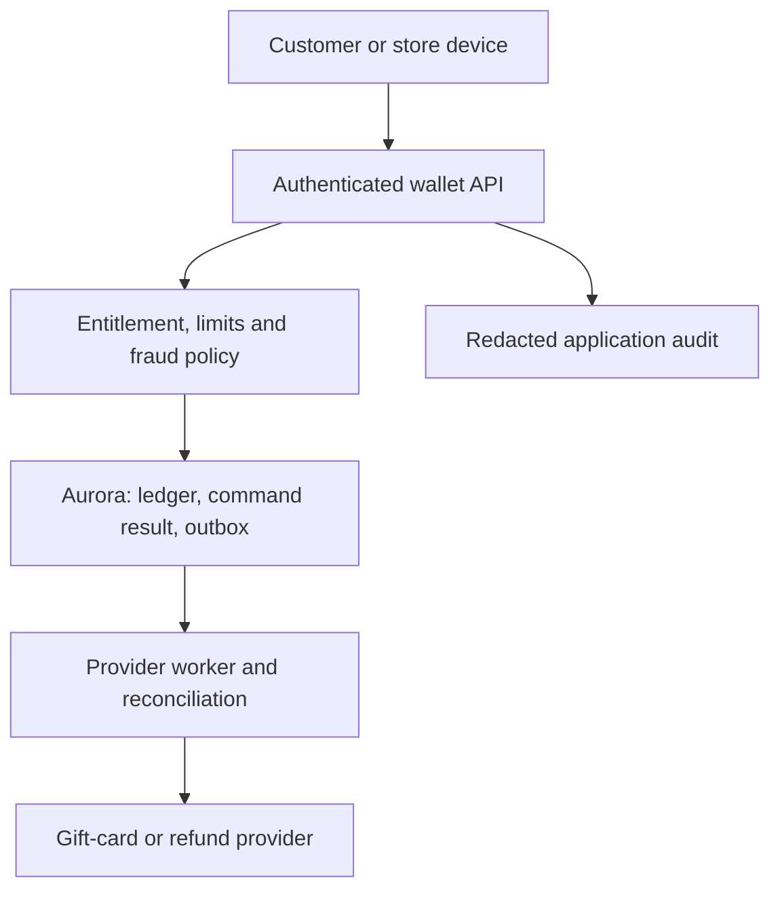

# Digital wallet and refunds: authority before automation

[Project index and working method](README.md) · [Programme Unit 6](../software-architect-grooming-programme-v5.html#day6)

## Frame the risk

The brief introduces stored value, instant refunds and partner gift cards across web, mobile and stores. Existing shared credentials and broad database access make incident evidence incomplete. It includes PCI-related controls, GDPR, partner providers, audit retention and fraud decisions under 300 ms. Those references are discovery constraints; this learning design does not determine legal obligations or certification scope.

Assume a single currency per account and online-authorised wallet debits for the first slice. Amounts use integer minor units with an explicit currency/scale; never binary floating-point money. Define refund entitlement from the original settled transaction, previous refunds and authorised adjustments. Clarify whether “instant” means an accepted refund request, immediate wallet credit or external settlement. Offline store operation does not automatically permit offline wallet spending.

## Worked ADR: an authoritative ledger and bounded refund commands

**Decision:** represent transfers with immutable balanced ledger entries; derive/reconcile balance views, and authorise each refund command against a remaining refundable amount. **Alternative:** directly increment/decrement a mutable balance field with an audit log added afterwards. **Reason:** the ledger preserves reconstructable value movement and reversal history. **Cost:** transactional posting rules, reconciliation and operational expertise. **Revisit:** change storage/partition design when measured contention requires it, while preserving the accounting invariant. A ledger label alone does not enforce correct posting.

Run the API on Fargate or Lambda according to latency, traffic and connection evidence. Use separate IAM roles for the API, reconciliation and reporting; private database access; scoped Secrets Manager/KMS permissions; and authenticated, revocable store-device identity. Customer/account entitlements remain application checks. CloudTrail records AWS actions; application audit records the subject, reason, policy decision and business operation without raw payment credentials.

Within a transaction, check the cumulative refund bound, claim a subject/transaction-scoped idempotency key, post balanced entries and create the outbox event. An external gift-card provider still needs a stable operation ID, unknown-outcome reconciliation and explicit settlement state. A network timeout must not lead to both a wallet credit and an untracked partner refund.

## Map security concepts to concrete evidence

| Preparation | Exact lab transfer | Unit 6 artifact |
| --- | --- | --- |
| [Programme security/resilience](../software-architect-grooming-programme-v5.html#day6) | 09 SecureLanding (`l9sec`), **Build the policy matrix**, **Break encryption access safely**. | Data-flow diagram, identity flow, allow/deny evidence. |
| [Durable workflow boundaries](../../../docs/cross-cutting-patterns/durable-workflows-and-idempotency.md) | 03 OrderFlow (`l3`), **Duplicate drill** and **Poison drill**. | Refund state/effect model and top-risk treatment. |
| [Recovery reasoning](../../../docs/system-design/reliability-and-failure-control.md) | 08 VaultGrade (`l8`), **THE DRILL**; 11 DataShift (`l11data`), **Restore and re-encrypt**. | Resilience plan including ledger reconciliation after restore. |

The [AWS IAM policy evaluation model](https://docs.aws.amazon.com/IAM/latest/UserGuide/reference_policies_evaluation-logic.html) is a useful source for predicting AWS access outcomes. It does not replace your account/refund entitlement checks.

## Experiment: two individually valid refunds that exceed the total

Create a synthetic settled purchase of 1,000 minor units and no prior refunds. Submit two different refund IDs for 700 each concurrently. Each looks valid alone, but their total is invalid. Expected: at most one accepted 700 refund under this policy, no over-refund, and balanced ledger postings. Repeat the accepted ID; it returns the original result without new value movement. Reuse that ID with 800 and reject the changed request.

Implement the aggregate check under the same transaction/locking boundary as the posting. Adapt the local reservation lab's concurrency technique; its stock decrement is not a ledger implementation. Then fail a provider call after it records success and test reconciliation. In a separate access drill, revoke a store device and attempt another customer's refund. Both must fail within the agreed revocation policy. Record decision traces and redacted identifiers, never real payment details.

Build a STRIDE table with concrete paths: stolen device credentials, modified amount, disputed operator action, leaked logs, retry floods and elevated refund privileges. Assign an owner and test to each top risk. Include independent restore, balance reconciliation and key availability in the resilience plan; an available database with wrong balances is a failed recovery.

## AI and the 300 ms fraud decision

Start with deterministic limits and a measured fraud-scoring baseline. A learned model may provide a risk signal; a deterministic policy decides allow, step-up, review or deny. Budget the entire path—identity, feature fetch, inference, policy and network—not just model time. Define the degraded policy if feature/model service fails, based on transaction risk.

SageStart 12 (`l9`) teaches model lifecycle mechanics, but its defect classifier is not a validated fraud model. Build time-split synthetic/lawfully available data, account for delayed labels and measure false approvals, false declines, calibration, drift and end-to-end tail latency. Do not place an unconstrained LLM in the money-moving decision path. A separate runbook assistant can draft an explanation for an operator with sources and no refund tool access.

## Defend it

Submit the data-flow diagram, STRIDE table, top-risk treatment, authentication/authorisation flow and resilience plan. Attach concurrent-refund and deny-path evidence.

- **“Why isn't an idempotency key enough?”** Different commands can jointly violate an aggregate value bound.
- **“Can the fraud model authorise a refund?”** It provides evidence to a bounded policy; identity and entitlement remain separate.
- **“Can we serve stale balances after a failure?”** Display and spend authorisation have different correctness requirements; name the authority and permitted degradation.

SAA lenses: secure workloads, data protection and recovery. Interview extension: accounting invariants and abuse handling. Compare the ledger boundary with the provider-intent boundary in [payments](regulated-payments.md).
