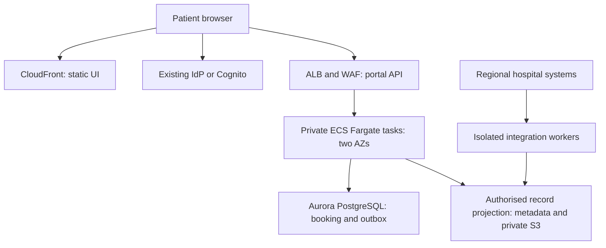
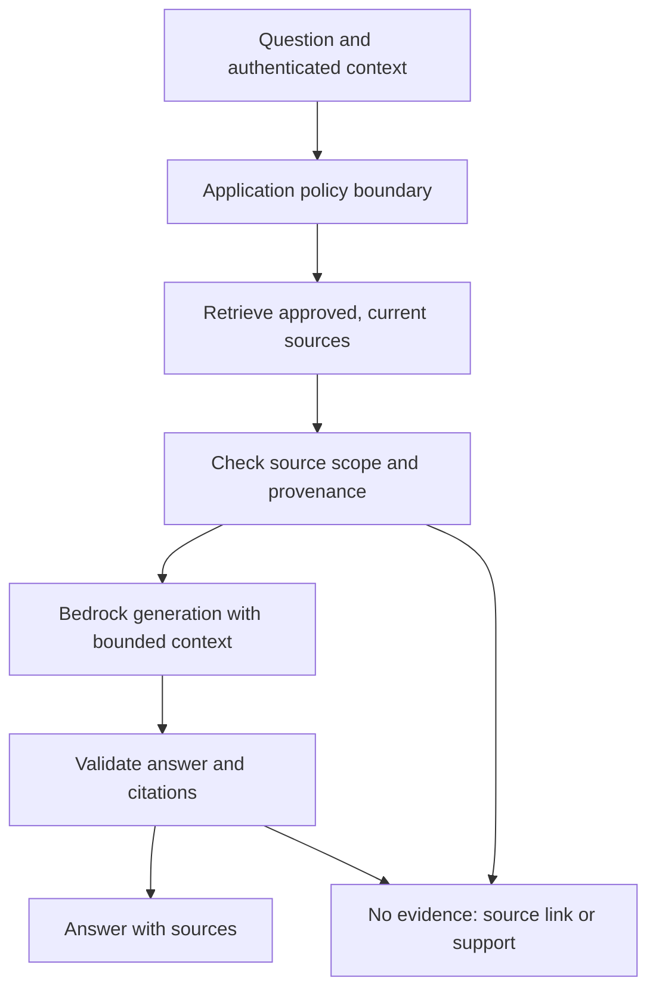
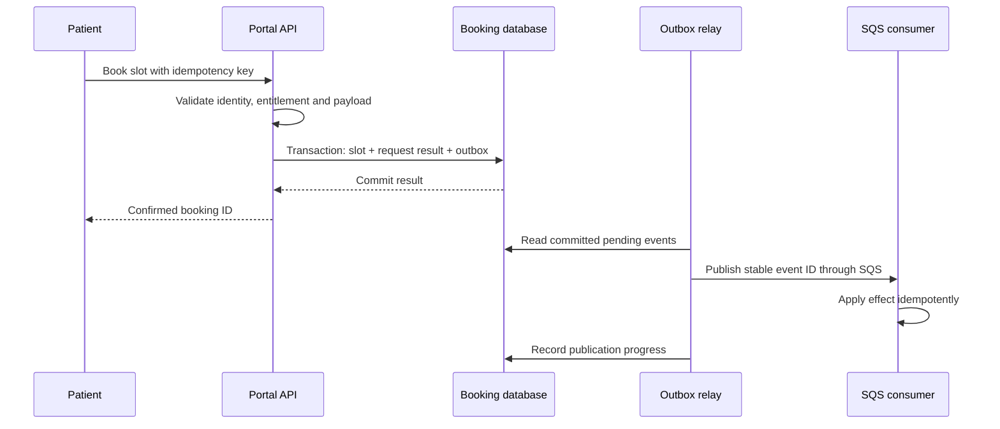

# Connect the dots: patient portal → architecture → AWS → AI

**Purpose:** practise turning one business problem into a solution you can build, test and defend in an interview. This companion extends the National patient access portal in [programme Unit 1](software-architect-grooming-programme-v5.html#day1); it does not add another syllabus. Reviewed 9 September 2026.

Use the same case throughout. Every study session must produce a decision, an experiment or a revised explanation. Reading a service description alone is not completion.

## 1. One case, three levels of explanation

The original brief replaces seven regional portals, aims to reduce call-centre demand by 30%, and includes records, appointments, prescriptions and clinician messaging. It has sensitive data, legacy integrations, accessibility obligations, a fixed first-year budget and phased rollout.

For the first learning slice, design **authorised record access and appointment booking**, then add an **optional assistant for approved administrative guidance**. Prescribing, clinical diagnosis and autonomous changes to patient care remain outside this slice. The broader portal still needs separate discovery for those capabilities.

| Level | Question to answer | Example |
| --- | --- | --- |
| Solution architecture | What outcome matters, to whom, under which constraints? | Preserve authorised access during one hospital integration outage without presenting stale records as current. |
| System/software design | Which ownership, consistency and failure mechanisms make that possible? | Maintain a versioned read projection, show freshness, isolate adapters and keep booking authority explicit. |
| AWS implementation and AI | Which services implement those mechanisms, and what remains application responsibility? | A portal API reads the projection; regional adapters update it asynchronously. Bedrock may explain approved administrative content; it does not determine record permissions or confirm bookings. |

These are different views of the same decision. You should be able to move between all three without changing the requirement.

## 2. Freeze assumptions before drawing AWS boxes

The following are **teaching assumptions requiring stakeholder agreement**, not healthcare policy or a claim of a production-ready national design.

| ID | Measurable requirement or constraint | Owner / consequence |
| --- | --- | --- |
| Q1 | During a 15-minute outage of one regional integration, eligible authorised reads of previously synchronised records sustain 200 requests/s, p95 below 500 ms and at least 99.9% success. | Clinical/data owner defines which records remain eligible, permitted age and explicit expiry behaviour. The targets extend Unit 1's worked example. |
| Q2 | Two concurrent requests for the last appointment slot produce at most one confirmed booking. Retrying a committed request returns its original result. | Booking owner; availability cannot override this invariant. |
| Q3 | Every record-access test checks the authenticated subject's entitlement to that record; all cross-patient deny fixtures pass. | Security owner; authentication alone is insufficient. This finite test set cannot prove absence of all access bugs. |
| Q4 | A portal-region recovery exercise aims for RTO ≤60 minutes and RPO ≤15 minutes for the explicitly listed portal-owned datasets. | Operations and data owners must agree recovery scope, data residency and cost. Legacy systems have separate recovery contracts. |
| Q5 | Booking and record access continue when the assistant is disabled. The assistant makes no booking or prescription writes. | Product owner; AI failure must not become a core portal outage. |
| Q6 | A pilot user can complete booking using keyboard and assistive technology; accepted workflow tests include assisted access and recovery. | Accessibility lead and representative users define acceptance; a cloud diagram cannot prove it. |

Also obtain: peak read/write mix, number and size of records, retention, residency, consent/revocation rules, existing identity provider, hospital API contracts, staffing/on-call capacity and an actual budget. Record unknowns instead of silently choosing defaults.

**Critical ownership decision:** for the worked booking transaction below, the pilot portal is the sole writer for the pilot appointment inventory. If the hospital remains the source of booking truth, the portal submits a request to that authority and shows **pending** until it receives authoritative confirmation. A locally atomic transaction cannot prevent another system booking the same slot.

## 3. The map across your existing material

Open the [AWS lab manual](../../handbooks/aws-saa-c03/saa-c03-lab-manual-v2.1.html) and select the **display number and title** below. Internal IDs are included because older handoff text uses different numbers; the manual does not provide stable per-lab URL anchors. Use its Design, Runbook, Handoff and Teardown material selectively. These are lab specifications/excerpts, not a pre-deployed portal.

| Portal decision | Architecture preparation | Existing AWS practice | Transfer into the portal | Evidence to keep |
| --- | --- | --- | --- | --- |
| D1: identity and access | [Unit 6](software-architect-grooming-programme-v5.html#day6), [decision method](../../docs/software-architecture/architecture-decision-method.md) | 09 SecureLanding (`l9sec`) | Separate patient sign-in, workforce AWS access, workload IAM and record-level authorisation. | Threat model and allow/deny matrix; trace of a denied cross-patient read. |
| D2: runtime and network boundaries | [Units 2](software-architect-grooming-programme-v5.html#day2) and [7](software-architect-grooming-programme-v5.html#day7) | 01 ShelfLife (`l1`), 05 FreshTrack (`l5`), 10 HybridHub (`l10net`) | Follow one request through load balancer, private application and database; isolate hospital adapters. | Deployment view; route and security-group explanation; ADR comparing compute options. |
| D3: booking correctness | [Units 4](software-architect-grooming-programme-v5.html#day4) and [5](software-architect-grooming-programme-v5.html#day5), [local reservation experiment](practice/reservation-lab.py) | 01 ShelfLife atomic stock update; 11 DataShift (`l11data`) | Transfer last-item stock into last-slot booking, with an explicit authoritative writer. | Schema/invariant, concurrent-run output, retry result and transaction sequence. |
| D4: reliable notifications | [durable workflows](../../docs/cross-cutting-patterns/durable-workflows-and-idempotency.md), Unit 4 | 03 OrderFlow (`l3`) | Transfer order outbox and duplicate drills into booking-confirmed events. | Crash/replay table, outbox age alarm, consumer idempotency decision. |
| D5: fresh-enough reads and recovery | [Unit 3](software-architect-grooming-programme-v5.html#day3), [reliability](../../docs/system-design/reliability-and-failure-control.md) | 11 DataShift; 08 VaultGrade (`l8`) | Separate source outage, AZ failover and Region disaster; test staleness and restore. | Q1 results, freshness policy, RTO/RPO timeline and reconciliation runbook. |
| D6: bounded AI assistance | [AI assurance](../../docs/ai-architecture/production-ai-assurance.md), [reasoning design](../../docs/ai-architecture/reasoning-system-design.md) | 13 DocuMind (`l10`); 14 OpsPilot (`l11`) only for the later authority discussion | Retrieve approved administrative information with provenance; learn the tool boundary without granting write authority. | Corpus/version manifest, eval cases, refusal/fallback traces and latency/cost breakdown. |
| D7: capacity and economics | [practice capacity model](practice/README.md#worked-capacity-and-latency-model), [inference systems](../../docs/ai-architecture/llm-inference-systems.md) | 00 Guardrails & the CI/CD Spine (`p0`); 05 FreshTrack; DocuMind | Estimate core traffic and optional AI traffic separately; cap spend and concurrency. | Assumption sheet, measured bottleneck, cost sensitivity and teardown evidence. |
| D8: defend and evolve | [Units 8](software-architect-grooming-programme-v5.html#day8), [9](software-architect-grooming-programme-v5.html#day9), [10](software-architect-grooming-programme-v5.html#day10) | Reuse outputs from the selected labs | Pilot one regional cohort; challenge failure handling and rollback before expanding. | C4 views, ADRs, rollout/rollback plan and a recorded oral defence. |

Use the [AWS visual handbook](../../handbooks/aws-saa-c03/saa-c03-visual-handbook-2026.09.html) when a service mechanism is unclear. Read only enough to explain your current decision, then return to the case.

## 4. Worked AWS solution, with reasons

**Starting hypothesis:** one AWS Region, application instances/tasks in two AZs, a modular portal backend, and separately deployable regional integration workers. Use a pilot to establish whether the pattern should become regional cells. This deliberately leaves national scale and final recovery topology to evidence.



The browser obtains a token from the identity provider and sends it to the API. The application validates issuer, audience and expiry, then evaluates subject-to-record permissions on every request. The diagram's arrows are logical requests, not evidence of permitted network routes. Draw public/private subnets, security groups, endpoints and trust boundaries in your deployment/threat views.

**D1 — Security.** Use the existing patient identity service if it meets integration and assurance needs; Cognito user pools are a candidate for application sign-in/federation. IAM Identity Center serves workforce AWS access. Task roles govern AWS calls; they do not encode each patient's entitlement automatically. Use private buckets, TLS, scoped IAM/KMS permissions and an application audit event containing subject, action, resource reference, decision and correlation ID. Keep clinical payloads and tokens out of ordinary logs. CloudTrail complements application audit; it does not explain your business authorisation decision.

**D2 — Compute.** ALB → ECS Fargate is a candidate for an existing containerised backend with sustained traffic and integration libraries. API Gateway → Lambda is a credible alternative for short, bursty, stateless requests. Compare operational skill, concurrency, startup latency, connection pressure, network access and actual cost. Do not combine both entry stacks merely to use more services. Start with modules for record access and booking; split deployments where failure isolation or team ownership justifies it.

**D3 — Data.** Aurora PostgreSQL is a candidate because the pilot needs relational booking constraints and transactional booking/idempotency/outbox updates. Define a unique active slot allocation, scoped idempotency key and canonical request digest. Use atomic constraints/locking rather than read-then-write application checks. DynamoDB conditional writes/transactions are an alternative when access patterns are explicit; explain keys, hot partitions and uniqueness enforcement before choosing it. The winner is determined by requirements, not “SQL cannot scale.”

Aurora's multi-AZ storage and replicas support availability, but you still configure compute failover, reconnect/retry behaviour and test application recovery. An RDS Multi-AZ DB instance standby and a read replica solve different problems; some RDS Multi-AZ cluster deployments also have readable instances. Be precise about the deployment type. See [Aurora high availability](https://docs.aws.amazon.com/AmazonRDS/latest/AuroraUserGuide/Concepts.AuroraHighAvailability.html).

**D4 — Events.** Commit a `BookingConfirmed` outbox row in the same transaction as the booking. A relay publishes committed rows to SQS and records delivery progress. A crash after publish can cause duplicate publication; consumers need their own effect-level idempotency. SQS FIFO ordering/deduplication does not make the database commit and an external email atomic. If a notification provider supports an idempotency key, pass a stable event ID. Otherwise describe the duplicate/loss trade-off and reconciliation; do not promise exactly-once email. See [transactional outbox guidance](https://docs.aws.amazon.com/prescriptive-guidance/latest/cloud-design-patterns/transactional-outbox.html) and [SQS redelivery semantics](https://docs.aws.amazon.com/AWSSimpleQueueService/latest/SQSDeveloperGuide/standard-queues-at-least-once-delivery.html).

**D5 — Records and resilience.** Hospital records remain authoritative at their source. A versioned portal projection is a read model, not a new clinical source of truth. Store source, version, observed time and permitted freshness. Expired or missing records produce an explicit unavailable state; never silently substitute an AI summary. Keep patient API responses out of shared caching by default; authorise any object download and consider URL lifetime/revocation. Isolate adapter queues/concurrency so one hospital outage does not exhaust all workers. Backups, replication and AZ failover are separate controls. Q4 needs a timed restore/failover rehearsal including IAM, KMS, secrets, configuration, DNS, integration reconnection and data reconciliation; DNS alone does not recover the portal.

**D6 — AI.** The first assistant answers “How do I prepare for this appointment?” using approved administrative documents. It neither diagnoses nor edits bookings. Its failure yields a source link or human support route. Start with deterministic retrieval plus a single generation step; add an agent only when a real workflow needs dynamic tool selection and the authority can be bounded.



DocuMind currently teaches manual RAG using embeddings → S3 Vectors → generation. Preserve those mechanics during the transfer; Bedrock Knowledge Bases is a separate managed alternative. For this slice, index public/synthetic administrative documents only. If extending to restricted material, derive mandatory filters from server-side identity and current entitlements, verify every retrieved item before sending context to the model, and enforce the same policy on cited-source access. A vector index is not an identity system; never accept a user-supplied tenant filter as permission. Bedrock supports [retrieval metadata filters](https://docs.aws.amazon.com/bedrock/latest/userguide/kb-test-config.html), but choosing and maintaining the correct policy is application work.

[Bedrock Guardrails](https://docs.aws.amazon.com/bedrock/latest/userguide/guardrails.html) can add configured content controls. They do not establish record entitlements, clinical correctness or transaction integrity. Treat retrieved text as untrusted data, strip tool authority from this assistant, bound input/output length and time, and validate citations against the actual retrieved sources.

**D7 — Economics.** At 200 requests/s and an assumed mean in-flight time of 0.2 seconds, Little's Law suggests about 40 concurrent requests in a steady state. This is not a task count or a sizing result; p95 latency is not the mean. Measure CPU, connections, queue age, error rates and tail latency under the expected mix. If 10% of requests invoke AI, model 20 AI requests/s separately. For each AI call, estimate input tokens (instructions + question + retrieved chunks), output tokens and retries; add embedding/index, logging and network costs. Use current regional prices and measured traffic rather than carrying a lab budget into production. Lower retrieval `k` only if your eval shows acceptable evidence coverage.

## 5. Go deep on one request

Here is the portal-owned booking path to explain on a whiteboard. It is a design contract, not shipped booking code.



| Interviewer changes one condition | Mechanism you must explain | Evidence / observable result |
| --- | --- | --- |
| Two patients race for one slot | Unique allocation/atomic update inside a transaction; handle the loser as a business conflict. | At most one confirmed booking; never negative availability. |
| Commit succeeds but response is lost | Retry uses the same subject-scoped key and matching request digest. | Original booking ID returned, no additional allocation. |
| Same key arrives with a different slot | Validate immutable request identity. | Conflict rather than replaying an unrelated result or making a second booking. |
| Process dies before commit | Transaction rollback. | No booking, no request result and no outbox event. |
| Relay dies after publishing | Pending row may be republished; stable event ID survives. | Consumer effect remains bounded by its idempotency policy. |
| Hospital owns the slot and its API times out | Local result is pending/unknown; query/reconcile using an external operation ID. | No invented confirmation; no blind second booking. |
| Permission is revoked | Re-evaluate access and define revocation propagation; short-lived tokens alone do not revoke all existing grants instantly. | Previously allowed subject denied within the agreed policy window. |

**Run now, without AWS:** from the repository root:

```bash
python3 learning-paths/software-architect/practice/reservation-lab.py
python3 -m unittest discover -s learning-paths/software-architect/tests -p 'test_reservation_lab.py' -v
```

The existing lab prints concurrent outcomes, `retry_matches`, rollback state and relay recovery. Predict them first. Record the SQLite version and actual output, then map `stock=1` to “one pilot slot” and `reserved` to “confirmed under the sole-writer assumption.” Its effect is a local simulated receipt; it proves neither AWS behaviour nor real notification-provider semantics. It also does not implement patient identity, hospital integration or a clinical data model. Name these gaps in your evidence record.

Next run OrderFlow's **Duplicate drill**, **Poison drill** and crash points in a permitted sandbox using synthetic data. Add portal event names and acceptance criteria to its handoff before building. Run the lab's teardown and retain the resulting resource inventory. AWS deployment is an exercise for you to execute and measure; this companion does not claim it has been deployed.

## 6. AI technical depth: diagnose the failing layer

| Symptom or interview question | Technical explanation to practise | Experiment |
| --- | --- | --- |
| Correct document never retrieved | Chunk boundaries, query vocabulary, embedding choice and index configuration affect candidate recall. Generation cannot reliably recover missing evidence. | Label expected source IDs, inspect top-k results, vary one retrieval parameter and compare hit rate. |
| Right evidence, unsupported answer | Generation/grounding failure; tighten answer scope, check citations and abstain when unsupported. | Hold retrieval fixed and compare answer claims with the supplied passages. |
| Restricted source appears | Authorisation/index lifecycle failure; prompt wording is not a fix. | Cross-scope request, changed entitlement, stale indexed copy and direct citation access deny tests. |
| A document says “ignore instructions” | Prompt injection through untrusted context. Separate data from instructions and remove consequential tools. | Seed that text in a synthetic document; confirm no extra data disclosure or tool action. |
| Response is valid JSON but wrong | Schema parsing proves shape, not factual or business validity. Refusals, timeouts and truncation also need handling. | Validate source IDs, permitted answer fields and unsupported-claim behaviour independently of JSON parsing. |
| Latency or cost doubles | Measure retrieval, generation, token volume, retries and queueing separately; avoid unbounded context. | Compare p50/p95 and cost per accepted answer for two `k` values against the same cases. |
| “Why not fine-tune?” | Retrieval supplies changing facts/provenance; adaptation may target a measured behaviour gap. Neither supplies access control. | Establish a retrieval/prompt baseline before proposing a dataset, training expense and evaluation plan. |
| “Why not an agent that books?” | Tools add external effects and authority. A booking command must still pass deterministic validation and explicit user confirmation. | Draw the proposed-command → authorise → confirm → idempotent execute boundary; keep this extension design-only. |

Create a small **development set** (for example 12 synthetic cases), then a separate **held-out set** before tuning. Include answerable, unanswerable, stale/conflicting, injected and restricted-source cases. Record expected sources and behaviour, actual retrieval, answer support, latency and token use. Count denominators and inspect failures; a tiny set is a debugging aid, not a statistical safety guarantee. Any observed unauthorised disclosure or write is a stop condition, even when the average score is high. Use a human-reviewed rubric to calibrate a model judge rather than letting the same model approve its own work.

## 7. Build one evidence pack over eight sessions

Budget 60–90 minutes for each initial session; AWS implementation and recovery drills can require additional sessions. Progress follows evidence, not the calendar. Keep the pack in your own working directory with synthetic data; do not commit private interview or patient material.

| Session | Produce | Challenge before moving on |
| --- | --- | --- |
| 1 — Frame | `01-brief.md`: stakeholders, Q1–Q6, unknowns and authoritative writers. | Which requirement changes if records cannot be stale at all? |
| 2 — Draw and compare | `02-views.md`: context, deployment and trust boundaries; `03-decisions.md`: initial compute/data ADRs. | Explain why every AWS service exists and remove one unjustified component. |
| 3 — Prove correctness | `04-booking-evidence.md`: predicted and observed local lab results, transaction sequence and transfer gaps. | Explain response loss versus transaction failure without saying “just retry.” |
| 4 — Trace AWS failure | `05-aws-evidence.md`: selected ShelfLife/FreshTrack and OrderFlow drills, versions, commands, results and teardown. | Where does a duplicate survive FIFO? Which identity permits each AWS call? |
| 5 — Recover | `06-recovery.md`: Q1 outage experiment, Q4 recovery plan and any measured restore results. | A backup exists: what still prevents users signing in after restore? |
| 6 — Add AI | `07-ai-evaluation.md`: bounded use case, DocuMind transfer, source manifest, dev/held-out results and fallback. | Distinguish a retrieval miss, an unsupported answer and an authorisation failure. |
| 7 — Operate and cost | `08-operations.md`: dashboard/alarm intent, cost assumptions, kill switch and phased rollout. | Which metric tells you users cannot book even though HTTP health checks are green? |
| 8 — Defend and revise | `09-defence.md`: five-minute narrative, reviewer challenges and changed decisions. | Redesign when the hospital becomes the sole booking writer or AI is unavailable. |

Every evidence entry uses this compact template:

```markdown
Decision / requirement ID:
Business reason and owner:
Assumptions, source of truth and authority:
Options compared; choice and accepted downside:
Technical mechanism; AWS mapping:
Lab/resource used and what was changed for this case:
Prediction; command/configuration/version; actual result:
Failure tested; result that would reverse this decision:
Evidence status: designed / locally demonstrated / AWS demonstrated / externally reviewed
Remaining gap; next experiment:
90-second explanation in my own words:
```

Do not turn an empty template into a completion claim. For example: “D3 locally demonstrated using SQLite; AWS transaction behaviour and hospital reconciliation remain untested” is useful evidence.

## 8. Prepare for the exam and the interview together

The SAA-C03 blueprint weights secure architectures 30%, resilient 26%, high-performing 24% and cost-optimised 20%. Map your evidence to those domains; AI practice here develops role/interview depth and does not replace blueprint coverage or imply every Bedrock topic is examined. Check the [official exam guide](https://docs.aws.amazon.com/aws-certification/latest/solutions-architect-associate-03/solutions-architect-associate-03.html) for the current scope.

| Exam lens | Portal rehearsal | Interview extension |
| --- | --- | --- |
| Secure | Patient identity versus workforce federation; private data access; KMS/IAM policy interaction. | Walk through a cross-patient request and explain who makes the deny decision. |
| Resilient | Queue decoupling, AZ failover, backup/restore and bounded retries. | Show the unknown-outcome state after a hospital booking timeout. |
| High-performing | Database access patterns, connection pressure, read replicas, caching and concurrency. | Show measurements and justify a freshness/performance trade-off. |
| Cost-optimised | Compute duty cycle, storage lifecycle, network paths and capacity choices. | Relate portal cost and AI cost per accepted answer to business value. |

For every practice-question mistake, record **the decisive constraint**, why your chosen service failed it, why the accepted option fits it, and one change that would make your original option appropriate. Re-enact the mistake in this portal rather than memorising only the answer.

**A defensible 90-second answer:** “The portal must preserve authorised access during a regional integration outage while protecting booking correctness. I separated a versioned record read model from the authoritative booking write path. For the pilot I would compare a modular Fargate backend with Lambda using traffic, dependencies and team operations skills; relational booking constraints favour Aurora as an initial hypothesis. A transaction stores the booking, retry result and outbox; consumers handle duplicate events. The administrative assistant is optional and has no write tools. I would validate concurrent booking, revocation, stale records, recovery and AI abstention before expanding. My current evidence distinguishes local lab results from AWS experiments still to run.”

Follow it with technical detail only when challenged. For a solution architect interview, lead with stakeholders and trade-offs; for a software/system design interview, lead with ownership, schema and failure sequence; for an AI/FDE interview, lead with workflow fit, evaluation and safe delivery. The underlying evidence remains the same.

**Judge's completion rule:** without notes, trace one requirement through decision → mechanism → AWS service → failure → lab result → artifact. Then answer a changed-constraint question and identify what your evidence does not prove. Use the programme's [assessment rubric](software-architect-grooming-programme-v5.html#assessment) for the full capstone; this transfer exercise is not a separate certification or an automatic pass.
